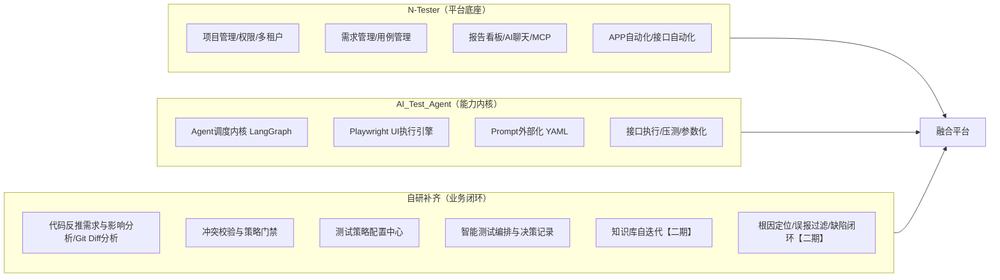
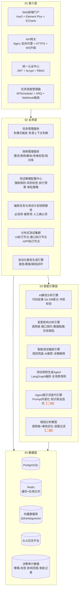
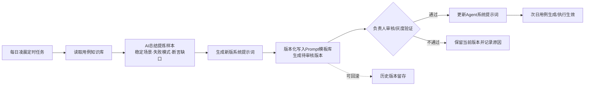
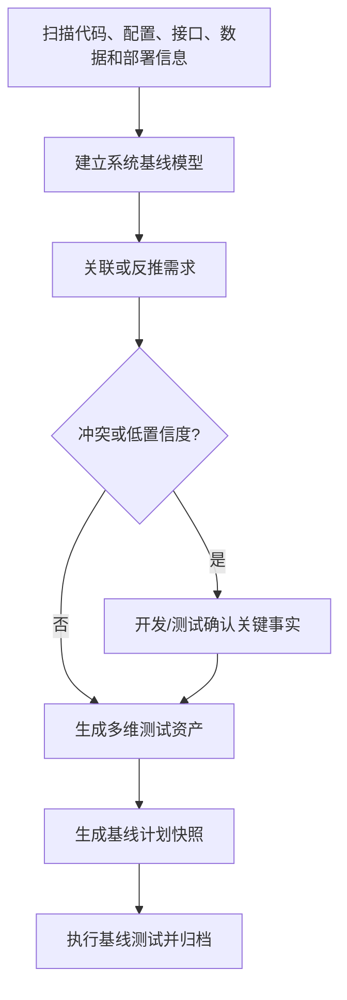
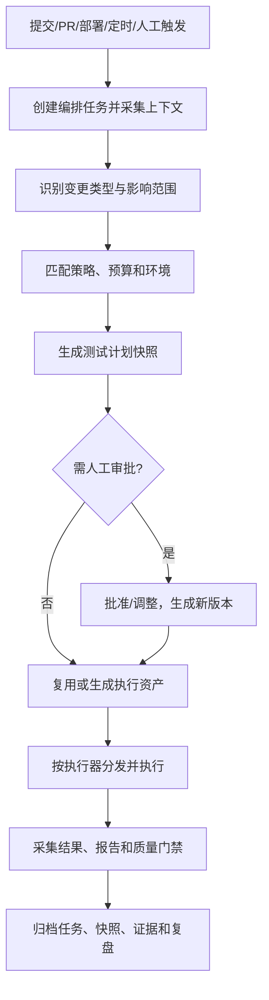
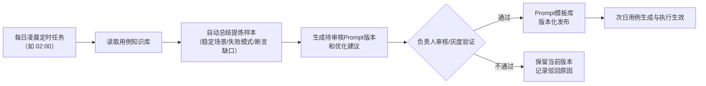
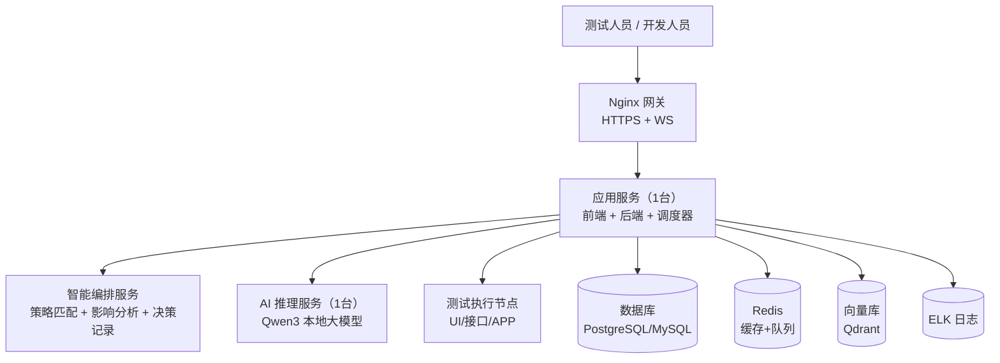
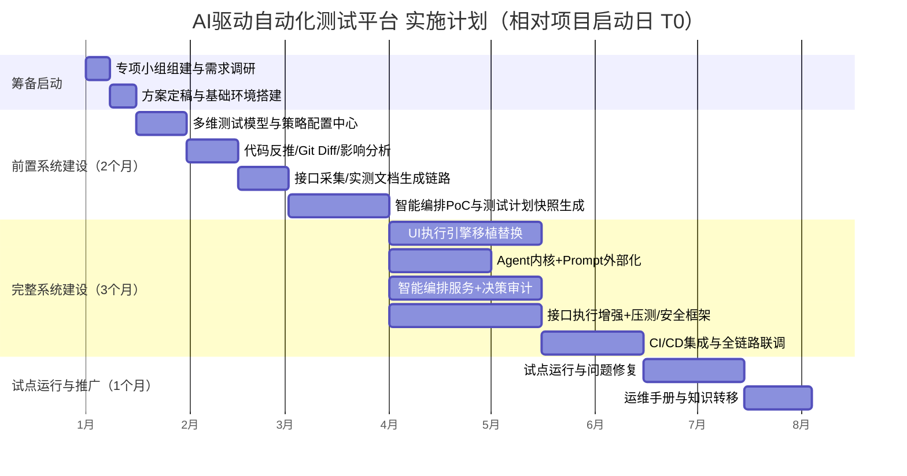

# AI驱动自动化测试平台落地实施方案

> **技术路线**：以 N-Tester 为平台底座 + 深度融合 AI_Test_Agent 的 Agent 调度内核与 Playwright UI 执行引擎 + 自研补齐业务闭环
>
> **文档版本**：v1.5 ｜ **状态**：待评审
>
> 目录

1. [项目概述](#1-%E9%A1%B9%E7%9B%AE%E6%A6%82%E8%BF%B0)
2. [总体技术路线：混合自研](#2-%E6%80%BB%E4%BD%93%E6%8A%80%E6%9C%AF%E8%B7%AF%E7%BA%BF%E6%B7%B7%E5%90%88%E8%87%AA%E7%A0%94)
3. [目标架构设计](#3-%E7%9B%AE%E6%A0%87%E6%9E%B6%E6%9E%84%E8%AE%BE%E8%AE%A1)
4. [功能模块规划](#4-%E5%8A%9F%E8%83%BD%E6%A8%A1%E5%9D%97%E8%A7%84%E5%88%92)
5. [核心业务流程设计](#5-%E6%A0%B8%E5%BF%83%E4%B8%9A%E5%8A%A1%E6%B5%81%E7%A8%8B%E8%AE%BE%E8%AE%A1)
6. [融合改造清单（落地核心）](#6-%E8%9E%8D%E5%90%88%E6%94%B9%E9%80%A0%E6%B8%85%E5%8D%95%E8%90%BD%E5%9C%B0%E6%A0%B8%E5%BF%83)
7. [数据与存储设计](#7-%E6%95%B0%E6%8D%AE%E4%B8%8E%E5%AD%98%E5%82%A8%E8%AE%BE%E8%AE%A1)
8. [部署方案与资源需求](#8-%E9%83%A8%E7%BD%B2%E6%96%B9%E6%A1%88%E4%B8%8E%E8%B5%84%E6%BA%90%E9%9C%80%E6%B1%82)
9. [实施计划与里程碑](#9-%E5%AE%9E%E6%96%BD%E8%AE%A1%E5%88%92%E4%B8%8E%E9%87%8C%E7%A8%8B%E7%A2%91)
10. [风险管理与应对](#10-%E9%A3%8E%E9%99%A9%E7%AE%A1%E7%90%86%E4%B8%8E%E5%BA%94%E5%AF%B9)
11. [验收标准与质量指标](#11-%E9%AA%8C%E6%94%B6%E6%A0%87%E5%87%86%E4%B8%8E%E8%B4%A8%E9%87%8F%E6%8C%87%E6%A0%87)
12. [附录](#12-%E9%99%84%E5%BD%95)

***

## 1. 项目概述

### 1.1 背景与痛点

当前测试团队面临的核心矛盾：

| 痛点 | 具体表现 | 影响 |
| --- | --- | --- |
| 人力资源瓶颈 | 仅 2 名测试人员需支撑十几个核心业务系统，任务量持续增长而资源投入刚性 | 任务积压风险上升，交付节奏受制约 |
| AI 生成代码质量风险 | 生成代码存在逻辑疏漏、命名不规范、冗余堆砌，可能引入未验证依赖、硬编码密钥、SQL 注入、版权复用风险 | 质量风险隐蔽，需更强的测试保障 |
| 测试覆盖度不足 | 手工编写用例效率低，边界与异常场景覆盖不全 | 质量风险难以提前暴露 |
| 流程缺失 | 变更影响分析、测试策略选择、用例/脚本生成、执行与报告链路依赖人工，缺少可配置的自动化决策闭环 | 版本快速交付受阻 |

### 1.2 建设目标

构建以 AI 为核心的自动化测试平台，实现：

- **多模式触发**：即时/定时/代码提交等多种任务触发方式
- **多源上下文输入**：需求文档、代码 Diff、接口定义、历史用例、缺陷记录、运行环境与变更风险共同作为测试决策依据；需求文档缺失时再启用代码反推
- **多维测试建模与智能编排**：不把测试能力限制在单一层次分类中，而是从测试层级、被测对象、测试目标、质量属性、执行方式、测试范围、触发阶段等多个维度描述测试资产，由规则引擎与 AI 自动组合本次任务的测试计划快照
- **变更影响驱动执行**：开发提交代码后，平台先分析变更影响和风险，再决定本次执行哪些测试，不默认每次都跑完整单元/集成/系统测试
- **规则兜底 + AI 推荐 + 人工门禁**：强制必测项由规则引擎保障，AI 负责扩展推荐与理由说明，高风险/低置信度场景进入人工确认
- **测试策略可配置**：支持按变更类型、风险标签、发布阶段、执行成本、环境限制配置测试策略，让平台可以从“自动执行”逐步演进到“可信自动决策”
- **并行执行与持续反馈**：静态分析、影响分析、用例生成、脚本生成和动态执行尽量并行；执行结果反哺知识库、策略规则和 Prompt
- **知识库自迭代** <span style="color:#e8590c">【二期】</span>：每日定时任务自动总结测试样本，动态更新 Agent 系统提示词
- **全链路闭环**：
  - 一期：任务触发 → 创建编排任务 → 多源上下文采集 → 变更影响分析 → 策略规则匹配 → 生成测试计划快照 → 自动化脚本 → 执行 → 报告
  - <span style="color:#e8590c">【二期】</span>：任务触发 → 智能编排 → 执行 → 根因定位/误报过滤 → 缺陷流转 → 资产沉淀 → 知识库自迭代


### 1.3 预期收益

本项目的收益不只体现在“测试执行更快”，还包括开发反馈前移、团队协作方式改善、质量治理标准化，以及集团范围内测试资产和工程能力的复用。以下目标值是一期试点建议值，正式立项后应以试点项目的基线数据重新校准。

#### 1.3.1 测试与质量收益

| 收益方向 | 衡量指标 | 一期建议目标 | 长期价值 |
| --- | --- | --- | --- |
| 测试效率 | 整体测试准备与执行效率 | 提升 ≥ 70% | 将测试资源从重复执行转向风险分析、质量设计和专项验证 |
| 回归效率 | 功能回归周期 | 缩短 ≥ 70% | 通过变更影响分析避免低价值全量回归，发布节奏更稳定 |
| 测试覆盖 | 需求、接口、核心流程和高风险场景覆盖率 | ≥ 90% | 从“测过多少用例”转向“关键风险是否被覆盖” |
| 用例准备 | 用例设计与脚本准备效率 | 提升 ≥ 80% | AI 负责初稿和扩展，测试人员聚焦规则校验和风险补充 |
| 缺陷发现 | 缺陷提前发现比例 | 较现状提升 ≥ 30% | 将问题尽量暴露在提交、合并请求和部署验证阶段 |
| 缺陷预测 | 高风险变更识别和缺陷预测准确率 | 提升 ≥ 50% | 逐步形成模块、接口和业务流程的风险画像 |
| 线上质量 | 逃逸缺陷率、重复缺陷率、回归遗漏率 | 持续下降 | 用历史缺陷和失败模式反哺测试策略和用例资产 |
| 测试稳定性 | 自动化用例稳定通过率、误报率、重跑率 | 稳定用例通过率 ≥ 95% | 降低“脚本本身不稳定”对研发和测试判断的干扰 |
| 可追溯性 | 需求-代码-用例-执行-缺陷关联完整率 | ≥ 95% | 发生质量问题时能够还原决策依据和责任边界 |
| 决策透明度 | 测试计划快照、策略版本和审批记录完整率 | 100% | 让 AI 测试决策可以审查、复盘、解释和回滚 |

#### 1.3.2 开发岗位收益

| 收益方向 | 对开发人员的帮助 |
| --- | --- |
| 更快获得反馈 | 代码提交后自动生成受影响范围测试，开发不必等待完整测试周期结束才知道问题 |
| 降低排查成本 | 报告关联变更文件、调用链、接口、日志和失败证据，帮助开发快速定位问题位置 |
| 减少重复工作 | 自动生成基础用例、接口调用、边界数据和回归脚本，开发把时间用于业务逻辑和架构改进 |
| 提升代码质量 | 将静态检查、组件测试、契约测试、接口测试和部署后验证纳入统一质量门禁 |
| 强化单元测试意识 | 平台可以接入开发侧 Pytest、JUnit、Go test 等结果，并展示单元测试覆盖和失败趋势 |
| 降低返工风险 | API 契约、数据库迁移、权限和关键业务流程变更能够在合并前得到针对性验证 |
| 支持 AI 编程治理 | 对 AI 生成代码增加依赖、权限、注入、数据一致性和回归检查，降低“生成即提交”的风险 |
| 形成开发自助能力 | 开发人员可以查看受影响测试、手动补充测试范围、重跑失败用例和查看质量门禁原因 |

#### 1.3.3 测试岗位与质量岗位收益

| 收益方向 | 对测试与质量岗位的影响 | 长期变化 |
| --- | --- | --- |
| 减少重复执行 | 自动化完成标准化回归、接口验证、冒烟检查和基础数据校验，测试人员减少机械性执行工作 | 测试人员将更多精力投入风险分析、质量设计、专项测试和缺陷预防 |
| 测试经验资产化 | 将风险标签、测试策略、用例属性、脚本、历史缺陷和决策记录沉淀到平台 | 降低对个人经验的依赖，便于新成员培训、项目交接和跨项目复用 |
| 测试工作风险化 | 根据变更影响、业务重要性、历史缺陷和发布阶段选择测试范围，而不是只按模块罗列清单 | 测试资源投入更加精准，测试活动与实际业务风险联系更紧密 |
| 质量工作数据化 | 通过覆盖率、漏测率、误报率、自动化稳定性、策略命中率和回归效率评价质量工作 | 测试管理从经验判断逐步转向基于数据的持续改进 |
| 专项能力统一管理 | 将接口、UI、APP、性能、安全、数据和 AI 专项测试纳入统一资产、任务和报告体系 | 测试岗位逐步向质量工程、质量架构和专项质量治理方向发展 |
| AI 决策协同 | 审核 AI 的变更影响分析、测试范围推荐、用例生成和质量门禁结论，补充 AI 未识别的业务风险 | 测试人员从单纯执行者转变为测试策略设计者和 AI 测试决策治理者 |

#### 1.3.4 团队协作收益

| 协作对象 | 预期收益 |
| --- | --- |
| 开发与测试 | 通过同一份测试计划快照、执行结果和决策记录协作，减少“开发认为改动很小、测试认为风险很大”的信息差 |
| 产品与业务 | 通过需求、业务流程、风险标签和验收结果关联，能够看到功能变更对核心业务链路的影响 |
| 测试与运维 | 将部署后冒烟、健康检查、回滚验证、日志和环境状态纳入同一流程，缩短上线验证和故障定位时间 |
| 架构与安全 | 对接口契约、数据链路、权限边界、依赖服务和安全风险形成统一检查入口 |
| 项目管理 | 通过任务状态、测试成本、缺陷趋势和质量门禁结果掌握项目交付风险，而不只看测试是否“执行完成” |
| 组织知识管理 | 将不同项目的高质量用例、风险规则和失败模式沉淀为可复用资产，减少重复建设 |

#### 1.3.5 对集团及长期经营的收益

| 收益方向 | 集团及长期经营价值 | 可观察结果 |
| --- | --- | --- |
| 质量治理统一 | 建立统一的测试资产模型、风险标签、质量指标、审批机制和审计口径，减少各业务线各自为战 | 不同项目可以使用统一的质量语言、流程和评价标准 |
| 测试能力复用 | 将接口、UI、APP、数据、性能、安全和 AI 测试能力沉淀为平台服务，按项目复用 | 减少重复采购、重复开发和各业务线单独建设的成本 |
| 核心风险可视化 | 从业务线、系统、版本、模块、接口和风险等级等维度汇总质量状态 | 管理层可以提前识别高风险系统、版本和交付环节 |
| 研发交付可预测 | 结合变更规模、风险等级、历史缺陷、测试耗时和环境资源估算交付成本 | 为项目排期、测试资源配置和发布决策提供数据依据 |
| 工程资产持续增值 | 将用例、脚本、策略、缺陷模式、执行数据和知识库沉淀为组织资产 | 平台使用越广，风险识别、测试推荐和问题定位能力越强 |
| 审计与合规支撑 | 对高风险变更、测试结果、人工审批、策略版本和缺陷关闭过程进行留痕 | 支持内审、外审、事故复盘和关键系统责任追溯 |
| AI 工程化落地 | 将 AI 生成代码、AI 应用、RAG、工具调用和本地模型纳入可测试、可评估、可审计的交付流程 | AI 能力从试验性使用逐步进入规范化研发和运营体系 |
| 长期成本优化 | 减少重复手工回归、脚本编写、环境验证和缺陷排查，把投入集中到高价值质量活动 | 随项目数量和交付频率增长，单个项目的测试边际成本逐步下降 |
| 组织规模化交付 | 通过规则、调度、执行节点和统一治理扩展测试能力，而不是线性增加测试人员 | 支撑集团系统数量、研发团队和发布频率持续增长 |
| 集团级技术竞争力 | 将测试平台、AI Agent、领域知识和质量数据结合，形成可持续迭代的内部工程能力 | 形成可复制、可推广、可持续演进的质量工程基础设施 |

> **远期总结**：平台最终要形成贯穿需求、设计、开发、提交、部署和运营的质量工程能力：开发获得更早反馈，测试沉淀可复用策略，团队共享同一份质量事实，集团获得跨项目的风险和成本视图。

### 1.4 建设分期：一期与二期

| 分期 | 范围 | 说明 |
| --- | --- | --- |
| **一期**（先落地） | 需求解析/代码反推、接口采集/实测文档、多维测试资产建模、变更影响分析、测试策略配置、测试计划快照自动编排、UI/接口/APP 自动化执行、报告看板、系统管理、阶段一部署 | 闭环"变更/需求→影响分析→策略匹配→测试计划快照→执行→报告" |
| **二期**（后建设） | 知识库自迭代、根因定位与误报过滤、缺陷智能闭环流转、测试资产沉淀、策略自优化 | 深化智能闭环 |

***

## 2. 总体技术路线：混合自研

### 2.1 三条路线对比

| 维度 | AI_Test_Agent 二次开发 | N-Tester 二次开发 | 完全自研 |
| --- | --- | --- | --- |
| 平台完整性 | 弱（缺权限、APP 自动化、需求管理等业务模块） | 强（需求-用例-脚本-报告链路完整） | — |
| 执行引擎 | 强（ActionStep 确定性执行、多 Selector 回退、录制健壮化） | 中（有录制回放但精细度不足） | — |
| Prompt 配置化 | 强（YAML 外部化，修改无需重启） | 中（有提示词模板管理，无懒加载机制） | — |
| 开发周期 | 需自建大量业务层 | 短（平台功能开箱即用） | 极长（全部模块从零开发） |
| 风险 | 业务闭环需大量自建 | 模块耦合度高、需侵入源码 | 工程坑全部自扛 |

**结论**：以 **N-Tester 为整体开发框架**，深度融合 **AI_Test_Agent 的 Agent 调度内核与 Playwright UI 执行引擎**，继承其 **Prompt 外部化配置能力**，进行**模块化二次开发**。

### 2.2 融合策略总览



| 来源 | 保留/吸收内容 | 策略 |
| --- | --- | --- |
| **N-Tester（底座）** | 前后端工程骨架（FastAPI + Vue3）、用户/角色/权限/业务线、项目管理、需求管理、用例管理、报告看板、AI 聊天助手、MCP 集成、APP 自动化、知识库 RAG | 直接复用，保留数据模型与 API 规范，按需改造 |
| **AI_Test_Agent（内核）** | Agent 调度内核（LangGraph）、Playwright UI 执行引擎（ActionStep/录制器/健壮化/多 Selector 回退/BrowserPool）、Prompt 模板外部化（YAML + 懒加载）、接口执行引擎（参数化/CSV 驱动/压测）、统一 LLM 客户端 | 代码级移植进 N-Tester 对应服务层，替换/增强其原生实现 |
| **自研补齐** | 代码反推需求与影响说明、Git Diff 智能差分、冲突校验与策略门禁、多维测试属性、测试策略配置中心、智能测试编排与决策记录、接口采集/实测文档生成链路（一期）；知识库自迭代、根因自动定位、误报过滤、缺陷智能闭环流转（二期） | 全新开发，对齐 PPT 核心流程，并补齐“AI 如何判断、如何配置、如何可解释”的落地机制 |

### 2.3 技术栈基线

| 层 | 技术选型 | 说明 |
| --- | --- | --- |
| 后端框架 | Python 3.11+ / FastAPI + Uvicorn | 全异步 ASGI |
| ORM | Tortoise ORM（N-Tester 现状） | 保留，必要时引入 SQLAlchemy 兼容层 |
| Agent 编排 | LangGraph + LangChain | 移植 ai_test_agent 的 agent/core.py 编排逻辑 |
| 浏览器自动化 | Playwright （Python） | 移植 ai_test_agent 执行引擎 |
| 接口执行 | httpx（异步） | 移植 ai_test_agent api_executor |
| 任务调度 | APScheduler | Cron 定时 + 重启恢复 |
| 任务队列 | Redis（可选） | 多 Worker 持久化队列 |
| 数据库 | PostgreSQL | 存储数据 |
| 向量库 | Qdrant（N-Tester 现状）/ pgvector | RAG 检索 |
| 认证 | JWT + bcrypt | 保留 |
| 前端 | Vue 3 +  Element Plus +  ECharts | 保留 |
| 实时通信 | WebSocket | 全流程进度推送 |
| 大模型 | 本地 Qwen3（27B Q4） | 统一 LLM 客户端 |

> **许可合规**：两个项目均为 **MIT 协议**，允许修改、商用与闭源发布，仅需保留版权声明。自研融合不存在法律障碍，但需在代码中保留原协议声明（详见第 10 章）。

### 2.4 核心技术对比：ORM 与向量库

#### 2.4.1 ORM 技术选型对比

**现状**：N-Tester 使用 **Tortoise ORM**（异步原生，aerich 迁移）；AI_Test_Agent 使用 **SQLAlchemy 2.0**。两套 ORM 在各自仓库均已跑通，是本项目可选的两种基线。

| 维度 | Tortoise ORM | SQLAlchemy 2.0 | SQLModel | Django ORM | Ormar | Piccolo |
| --- | --- | --- | --- | --- | --- | --- |
| 异步支持 | 原生异步（asyncpg/aiomysql） | 原生异步（2.0起），AsyncSession 完整支持 ORM 功能 | 继承 SQLAlchemy 2.0 异步能力，基于 AsyncSession 封装 | Django 4.1+ 部分异步，ORM 核心仍同步，FastAPI 中需 sync_to_async | 原生异步，专为 FastAPI 设计 | 原生异步 |
| 生态 / 社区 | 较小（5.5k+ stars），更新节奏慢 | Python ORM 事实标准（11.7k+ stars） | 较新，FastAPI 作者维护 | Django 框架内置，生态极大，但脱离 Django 使用不便 | 较小，但定位明确（FastAPI mini ORM） | 较小 |
| 迁移工具 | aerich（基础够用） | Alembic（成熟） | Alembic | 内建 migrations 系统，功能成熟，支持 squashing | 依赖 Alembic | Piccolo migrations |
| 复杂查询能力 | 中等（子查询/窗口函数较弱） | 强（CTE/窗口函数/复杂聚合） | 同 SQLAlchemy | 强，支持聚合、annotate、子查询，但复杂 SQL 不如 SQLAlchemy 灵活 | 中等，mini ORM 定位，复杂查询需要 raw SQL | 中等 |
| 与 FastAPI 契合 | 好（Django 风格 API，一行跨表查询） | 好（async session 成熟） | 最好（Pydantic 融合） | 差，Django ORM 与 FastAPI 集成需要额外包装，官方不推荐 | **好**，模型可直接用作 response_model，Pydantic 原生融合 | 好 |
| 学习成本 | 低 | 中高（Data Mapper 模式） | 低 | 中，如果熟悉 Django 则低，反之需学一套框架 | 低，API 极简，但生态小 | 低 |
| 切换成本（自现状） | —（现状） | 中（重写全部 models + 数据访问 + 迁移链） | 高 | 高 | 中 | 高 |

**结论与建议**：

- **保留 Tortoise ORM**：① 异步原生，对"项目管理平台"这类以 CRUD + 简单聚合为主的场景能力完全够用；② N-Tester 的 models/services 全部绑定 Tortoise，切换 = 重写全部数据访问层与迁移链（估算 4 周）。
- **切换 SQLAlchemy 2.0 + Alembic**：出现强复杂查询需求（窗口函数、CTE、跨库聚合），或需要与 ai_test_agent 数据层深度复用（两仓库统一 ORM 减少心智负担）时再切——SQLAlchemy 是唯一值得的切换目标。
- **低成本保险措施（推荐）**：新代码统一走 **Repository/DAO 数据访问层**，业务逻辑不直接依赖 ORM API；未来切换只替换 DAO 实现，不动业务层。

#### 2.4.2 向量库技术选型对比

**现状**：N-Tester 默认 **Qdrant**，AI_Test_Agent 默认 **pgvector**（不可用时自动降级关键词匹配）。RAG 服务层已集中封装（入库/检索/删除/集合管理），**切换只改 adapter，前端零改动**。

| 方案 | 定位 | 推荐规模上限 | 部署形态与环境要求 | 运维成本 | 切换成本 |
| --- | --- | --- | --- | :---: | :---: |
| **Qdrant**（现状） | 轻量高性能 | 百万～亿级 | 单 Docker 容器；内存约 200MB～1GB 起；支持量化压缩与混合检索 | 低 | — |
| **pgvector**（可选） | PG 扩展 | 单机 ≤1000 万 | 随 PostgreSQL，零新增组件（CREATE EXTENSION vector）；高维 HNSW 内存占用大 | 极低 | 低 |
| **Milvus** | 分布式大规模 | 千万～百亿级 | Standalone：≥8G 内存 / 4 核 / 50GB SSD / Docker 20.10+；分布式需 etcd+MinIO；GPU 版需 NVIDIA 驱动 + CUDA | 高 | 中 |
| **Weaviate** | 灵活 schema | 千万级 | Docker 容器，GraphQL 接口 | 中 | 中 |
| **Elasticsearch** | 复用搜索基建 | 千万级 | JVM 堆内存需专门规划（生产建议 8G+） | 高 | 中 |
| **Chroma** | 原型验证 | 百万以下 | 嵌入式进程内库，无独立服务 | 极低 | 低 |
| **Pinecone** | 托管云 | 亿级 | 全托管，数据出域 | 零（托管费） | 不适用（私有化） |

**结论与建议**：

- **阶段一保持 Qdrant**：单容器、内存友好、支持混合检索，规模上限（百万～亿级）。
- **升级触发条件**：向量规模上千万、需要 GPU 加速、多副本高可用 → 评估 Milvus；公司已有 ES 基建且希望统一日志 + 检索 → 可接 ES，否则不单独引入。
- **关键提醒**：检索效果主要由 **embedding 模型**决定（换 embedding 需全量重建索引，影响远大于换向量库）；两个开源项目均内置向量库不可用时的关键词降级兜底，切换失败不会中断主流程。

***

## 3. 目标架构设计

### 3.1 四层架构总览

分层解耦架构落到具体组件：



| 层 | 核心组件 | 来源 | 核心职能 |
| --- | --- | --- | --- |
| 接入层 | Web 门户、API 网关、认证中心、任务调度 | N-Tester（保留）+ 自研（触发扩展） | 统一入口、鉴权、流量控制、任务触发 |
| 业务层 | 编排任务/用例管理、测试策略配置、测试计划快照、测试集群、报告引擎 | N-Tester（保留）+ ai_test_agent（执行集群移植）+ 自研（策略与编排） | 任务管理、策略配置、测试计划快照生成、执行调度、知识沉淀、报告生成 |
| 智能引擎层 | 静态分析、变更影响分析、智能测试编排、用例生成 Agent、提示词迭代、根因分析 | ai_test_agent（Agent 内核）+ 自研（影响分析/编排/反推/迭代/根因） | AI 负责影响识别、测试推荐、决策解释与持续优化 |
| 数据层 | PostgreSQL/MySQL、Redis、向量库、ELK、决策审计数据 | N-Tester（保留）+ 自研新增表 | 持久化、缓存、向量检索、日志治理、策略与编排过程可追溯 |

### 3.2 关键技术设计

#### 3.2.1 Agent 调度内核（吸收 ai_test_agent）

- **LangGraph 工作流状态机**：将"创建编排任务 → 多源上下文采集 → 变更影响分析 → 策略规则匹配 → 生成测试计划快照 → 用例/脚本准备 → 执行调度 → 报告分析"编排为可回放、可中断、可重试的图结构。
- **AgentState 按 task_id 隔离**：每个测试任务独立状态上下文，避免多任务并发互相污染。
- **工具注册机制**：LangChain Tool 统一注册（代码差分解析、需求解析、接口解析、影响分析、用例生成、脚本执行、报告分析等工具），LLM 按需调用。
- **职责边界**：核心测试功能（确定性执行）不依赖 Agent；强制必测项由规则引擎兜底，Agent 负责"为什么测、测哪些、如何组合"，保证执行可靠性与决策可解释。

> 移植文件参考：`agent/core.py`（UITestAgent 任务编排）、`agent/langgraph_agent.py`（LangGraph 编排初始化）。

#### 3.2.2 Playwright UI 执行引擎（吸收 ai_test_agent）

以 **ActionStep 统一数据模型** 为核心，串联录制、AI 生成、执行三段链路：

| 能力 | 设计要点 |
| --- | --- |
| ActionStep 统一模型 | 22 种 action 类型；字段含 action/selector/selectors（候选回退列表）/value/expected/optional 等 |
| 录制器 | 有头浏览器 JS 事件注入 + 200ms 轮询；SPA 路由双路保障（MutationObserver + popstate/hashchange）；智能步骤补全（登录/提交/导航） |
| 步骤健壮化 | Selector A/B/C/D 四级评级；多候选推导；关键操作后自动插入 wait + assert |
| 多 Selector 回退 | 执行时逐候选探测（wait_for_selector 2s），应对动态 id / 框架重构 |
| 登录态快照 | storage_state 复用 + TTL 自动刷新，批量执行零耗时建会话 |
| 多浏览器并行 | 同一批用例 Chromium/Firefox/WebKit 并行执行，各出报告 |
| 并发保护 | BrowserPool Semaphore(6)；同任务执行/录制双锁防重复触发（409） |
| 控制流 | if/else/while 步骤级控制流，ast 白名单安全求值 |

> 移植文件参考：`skills/action_runner.py`、`skills/recorder.py`、`skills/step_hardener.py`、`skills/test_executor.py`、`skills/parallel_runner.py`、`skills/control_flow.py`、`tools/browser.py`、`tools/action_schema.py`。

#### 3.2.3 Prompt 模板外部化与自迭代（吸收 + 自研增强）【一期＋二期】

- **外部化**（一期）：所有 LLM Prompt 统一存放于 `skills/prompts/*.yaml`，按场景分文件（用例生成/场景规划/接口用例/代码分析等）。
- **懒加载 + LRU 缓存**（一期）：修改 YAML 后下次调用自动生效，**无需重启服务**，调优不改代码。
- **自研增强——系统提示词自迭代** <span style="color:#e8590c">【二期】</span>：
    - 每日凌晨定时任务（如 02:00）
    - 读取用例知识库（执行结果、缺陷记录、用例变更日志）
    - AI 自动总结提炼样本：哪些场景稳定、哪些断言缺失、哪些步骤易失效
    - 生成新的 Prompt 版本和优化建议，进入审核/灰度流程（版本化、可回滚）
    - 审核通过后更新 Agent 系统提示词，次日生效；效果不达标时自动回滚



> 移植文件参考：`skills/prompt_loader.py`（YAML 加载器）、`skills/prompts/*.yaml`（模板样例）。

#### 3.2.4 多模式触发与多源上下文（自研）

- **触发方式**：代码提交、合并请求、部署/发布事件、手动触发和定时触发（Cron）。
- **上下文聚合**：触发后系统聚合需求文档、代码 Diff、接口定义、历史用例、缺陷记录、执行日志、环境配置与风险标签，作为本次编排任务和测试计划快照的决策输入。
- **需求来源判断**：系统自动检测任务是否关联最新的需求文档：
    - **有文档** → 智能差分分析（Git Diff + 需求变更对比）
    - **无文档** → 代码反推需求与影响说明，作为候选测试依据；高风险或低置信度时进入人工确认，普通变更自动继续

#### <span style="color:#e8590c">3.2.5 知识库自迭代闭环（自研）【二期】</span>

见 3.2.3 自迭代流程 + 第 5.3 节。核心：把"执行结果/缺陷数据/用例变更"作为样本输入，反向优化 Agent 提示词与用例库，形成**测试资产持续增值**的飞轮。

#### 3.2.6 执行引擎职责分离（吸收 ai_test_agent 设计理念）

| 引擎 | 特性 | 并发模型 |
| --- | --- | --- |
| UI 执行引擎（Playwright） | 依赖浏览器状态，天然串行 | BrowserPool 信号量控制，多浏览器并行 |
| 接口执行引擎（httpx） | 纯 HTTP，天然并发 | 异步并发 + 压测模式（TPS/P95/P99） |

> 强行为 UI 和接口设计统一抽象会互相污染，保持两类引擎独立演进。

#### 3.2.7 只读模式与并行执行

- 测试执行以只读模式运行，全程不修改被测代码与环境。
- 静态分析（代码/需求）与动态执行（UI/接口）并行，兼顾效率与安全。
- 分布式执行节点可动态增减，7×24 小时运行。

#### 3.2.8 统一测试分类与测试资产模型

本节是全平台唯一的测试分类定义。平台不把单元、集成、系统测试串成固定流水线，而是给同一测试资产贴多个维度的标签，再由策略和变更影响决定本次是否执行。

| 维度 | 示例 | 用途 |
| --- | --- | --- |
| 作用域 | 单元、组件、集成、系统、端到端 | 表示覆盖边界和依赖范围 |
| 目标 | 功能、流程、业务规则、接口、数据、报表、批处理、工作流 | 表示要验证什么 |
| 质量属性 | 性能、安全、可靠性、兼容性、可用性、隐私、数据一致性、灾备 | 表示质量风险类型 |
| 被测对象 | API、UI、APP、数据库、中间件、消息链路、模型、RAG、工具调用 | 表示测试对象 |
| 执行方式 | 自动化、手工、半自动、探索性、随机、模糊、灰度、金丝雀 | 表示如何执行 |
| 范围与阶段 | 冒烟、Sanity、回归、验收、专项、增量、全量；提交、PR、部署后、发布前 | 表示何时、测多大范围 |
| AI 专项 | 效果、幻觉、偏见、提示注入、越狱、长上下文、推理性能、成本、漂移 | AI 应用或模型链路专用标签 |

分类之间不是并列目录。例如“支付下单”可以同时是 `integration + api + business_rule + data_consistency + regression`。测试资产应保存结构化标签，测试计划快照按标签筛选，不把一个用例强行归入单一分类。

```yaml
scope: integration
test_object: [api, database, message]
objectives: [functional, business_rule]
quality_attributes: [data_consistency]
execution_mode: automated
test_scope: [smoke, regression]
trigger_stage: [pull_request, post_deploy]
risk_tags: [order, payment]
```

后续章节只引用这些标签，不再重新定义测试分类：

- `3.2.9` 判断变更影响哪些对象；
- `3.2.10` 根据影响和策略选择哪些标签对应的测试；
- `3.2.11` 解释选择结果并决定是否人工确认；
- `4.3` 说明这些测试由什么执行器完成。

#### 3.2.9 变更影响分析

平台采用“确定性信号 + 依赖关系 + AI 语义分析”的方式判断影响范围，不让大模型凭自然语言猜测。

| 分析输入 | 分析内容 |
| --- | --- |
| Git Diff、提交说明、分支/PR | 文件、函数、接口、配置和变更意图 |
| 依赖图、调用链、服务边界 | 直接调用方、上下游服务和跨服务流程 |
| API、Schema、消息和部署配置 | 契约、数据链路、消费者、迁移和回滚影响 |
| 需求、用例、历史缺陷和失败记录 | 业务规则、历史风险和相似回归范围 |
| 环境、执行器、数据和发布阶段 | 当前可执行能力、成本和门禁约束 |

分析步骤：

1. 规则识别变更类型：逻辑、API、数据库/消息、UI、权限、配置、部署或 AI 链路；
2. 静态分析和依赖图扩展直接、间接受影响对象；
3. AI 结合需求、历史缺陷和业务标签补充语义影响；
4. 输出已确认影响、可能影响、未发现影响、风险等级和置信度；
5. 将证据、版本和分析结果写入编排任务，供策略匹配和审计使用。

典型映射：API 契约变化关注消费者和契约测试；数据库迁移关注读写方、历史数据和回滚；UI/权限变化关注关键路径和越权；Prompt/RAG/工具变化关注效果、安全和推理性能。低置信度或高风险不自动缩小范围。

#### 3.2.10 测试策略匹配与质量门禁

测试策略是长期配置；编排任务是一次触发；测试计划快照是本次任务冻结的测试范围。每次代码提交都会创建编排任务，但不一定执行完整单元、集成和系统测试。

| 策略项 | 主要配置 |
| --- | --- |
| 变更与风险 | 路径、文件类型、契约变化、业务风险标签 |
| 强制必测 | 安全、权限、迁移、核心链路和发布前最低集合 |
| AI 推荐 | 置信度阈值、推荐上限、历史缺陷和相似变更规则 |
| 阶段与环境 | 提交、PR、部署后、定时、发布前；环境、账号、数据和依赖 |
| 成本与审批 | 最大耗时、用例数、并发数、压测/全量开关、人工审批条件 |

合并顺序固定为：

1. 规则引擎生成不可跳过的必测项；
2. AI 根据影响范围和历史证据补充推荐项；
3. 按阶段、环境和预算裁剪；
4. 高风险、低置信度、超预算或破坏性测试进入审批；
5. 生成并冻结测试计划快照，保存策略版本和决策依据。

AI 只能增加测试，不能删除强制必测项。平台默认执行“变更影响驱动的最小充分测试”，提交阶段偏快速反馈，发布前再扩大到核心端到端、安全和性能基线。

策略配置示例：

```yaml
trigger_stage: pull_request
change_type: api_contract_change
risk_tags: [order, permission]
mandatory_tests: [contract, affected_integration, permission_regression]
recommended_tests: [core_order_e2e, historical_bug_regression]
approval_when: [high_risk, low_confidence, over_budget]
budget: {max_minutes: 30, max_cases: 200}
```

#### 3.2.11 决策解释与人工确认

每份测试计划快照必须能回答“测什么、为什么测、为什么没测、谁批准”。记录至少包括：

| 记录项 | 内容 |
| --- | --- |
| 影响与依据 | 受影响对象、证据、需求/代码/策略版本 |
| 测试范围 | 必测、推荐、跳过、待审批项及对应标签 |
| 可信度与成本 | 风险等级、AI 置信度、预计耗时、用例数和资源 |
| 审批与版本 | 审批人、调整内容、驳回原因、快照版本 |
| 结果与复盘 | 执行结果、缺陷、漏测、误报和策略改进建议 |

门禁规则：

- 低风险且高置信度：自动执行；
- 中风险：必测项自动执行，推荐项按项目策略处理；
- 高风险、低置信度、超预算、生产近似压测、混沌或正式验收：人工确认；
- 审批调整不覆盖原快照，而是生成新版本，保证历史任务可复现。

***

## 4. 功能模块规划

### 4.1 需求管理模块（N-Tester 基础 + 自研增强）

| 功能 | 来源 | 说明 |
| --- | --- | --- |
| 需求文档上传/在线编辑/版本管理 | N-Tester | Word/PDF/Markdown 多格式 |
| AI 需求拆分/评审/语义检索 | N-Tester | RAG 增强 |
| **代码反推需求与影响说明** | 自研 | 无文档时 AI 逆向生成候选需求、影响范围和测试依据；高风险或低置信度时人工确认，普通变更自动继续 |
| **Git Diff 智能差分分析** | 自研 | 有需求文档，对增量代码进行梳理，判断标记和修改需求文档，自定义规则需求优先级判定，需求文档和代码冲突检测，进行异常标记留存 |
| **接口采集文档生成** | 自研 | 需求/代码解析 → 标准化接口采集文档（必要时审核） |
| **接口实测文档生成** | 自研 | 整合解析数据与冲突标记，输出全覆盖实测标准文档 |

### 4.2 用例管理模块（N-Tester + ai_test_agent 增强）

| 功能 | 来源 | 说明 |
| --- | --- | --- |
| 用例 CRUD / 模块树 / 等级（P0-P3）/ 步骤管理 | N-Tester | 保留 |
| 用例导入导出（Excel/XMind/Markdown） | 两者 | N-Tester 基础 + ai_test_agent 的 Excel 条件格式导出 |
| **多维测试属性** | 自研 | 用例维护测试层级、被测对象、测试目标、质量属性、执行方式、测试范围、触发阶段和风险标签，支持多标签组合 |
| **AI 用例生成（6 种测试方法）** | ai_test_agent | 等价类/边界值/判定表/场景法/错误推测/状态转换，分段并行生成 |
| **需求变更增量更新（AI Diff + 用例级合并）** | ai_test_agent | 仅更新变更模块，deprecated 单独存储 |
| **需求追踪矩阵** | ai_test_agent | 用例-需求双向映射、覆盖率可视化、缺口分析补用例 |
| 离线批量生成/在线实时生成 | N-Tester | 保留 |

### 4.3 自动化执行模块

自动化执行模块负责“怎么执行”，不负责“本次应该测什么”。它接收 3.2.9 生成、并在必要时经过审批的**测试计划快照**，根据快照中的测试集合、执行环境和依赖条件准备脚本与测试数据，再把任务分发给对应执行器。测试范围、必测项、推荐项和人工门禁由 4.4 智能测试编排模块决定。

| 子模块 | 来源 | 说明 |
| --- | --- | --- |
| WebUI 自动化 | ai_test_agent（移植替换） | AI 场景规划 → 录制 → 健壮化 → 执行；可视化步骤编辑器；多浏览器并行 |
| 接口自动化 | N-Tester（基础）+ ai_test_agent（增强） | 多来源用例（Swagger/Curl/自然语言/代码/Postman/HAR）；参数化三层变量池；CSV 数据驱动；压测 |
| APP 自动化（需连接手机） | N-Tester | Appium 集成、设备管理 |
| 脚本生成 | 两者 | 一键生成 Pytest/Unittest/TestNG 脚本，自然语言操作描述（使用playwright ），可人工介入 |
| 测试计划快照执行与调度 | 自研 | 接收最终测试计划快照，准备/复用脚本，按执行器能力分发测试，负责并发控制、重试、超时、进度推送和结果收集 |
| 定时/并发执行 | N-Tester + ai_test_agent | Cron 定时、分布式并发、WebSocket 实时进度 |
| 安全测试 | ai_test_agent（移植） | 渗透扫描引擎 12 模块，AI 修复建议（仅授权场景） |
| 压测与性能分析 | <span style="color:#e8590c">自研 【二期】</span> | 并发/时长/爬坡策略，TPS/P95/P99 实时指标，性能分析报告 |


#### 4.3.1 测试执行器与测试资产映射

本节不重新定义测试分类，只说明测试计划快照中的资产交给谁执行。分类标签统一见 3.2.8，范围由 3.2.9～3.2.11 决定。

| 资产标签/能力 | 执行器 | 典型结果 |
| --- | --- | --- |
| `scope: unit/component` | 开发 CI、Pytest/JUnit/Go test | 通过率、覆盖率、日志 |
| `test_object: api/contract` | HTTPX、Newman、Karate、Pact 适配器 | 响应断言、契约验证、接口报告 |
| `test_object: ui` | Playwright，必要时 Selenium | 截图、视频、Trace、页面断言 |
| `test_object: app` | Appium 设备节点 | 设备日志、截图、移动端结果 |
| `test_object: database/message` | SQL、消息和数据校验适配器 | 数据一致性、消息链路、迁移结果 |
| `quality: performance` | k6/JMeter 等专项执行器 | TPS、P95/P99、容量和阈值 |
| `quality: security` | OWASP ZAP 等授权扫描器 | 漏洞、风险等级和修复建议 |
| AI 专项 | AI 评测、红队和推理性能执行器 | 效果、幻觉、安全、延迟、成本 |

执行模块负责资源准备、并发、重试、超时、隔离和结果采集，不改变已批准的测试计划范围。

#### 4.3.2 执行能力覆盖矩阵

| 能力 | 一期 | 二期/远期 | 说明 |
| --- | --- | --- | --- |
| 单元/组件结果接入 | 支持 | — | 接入开发 CI，不替代开发维护单元测试 |
| API、契约和数据驱动 | 支持 | 增强 | HTTPX、Newman、Pact、Mock 等 |
| WebUI 自动化 | 支持 | 增强 | Playwright、多浏览器、录制和健壮化 |
| APP 自动化 | 支持 | 增强 | Appium、设备管理和并发会话 |
| 数据库/消息测试 | 基础接入 | 完善 | SQL 断言、迁移、回滚和消息链路 |
| 性能测试 | 基础框架 | 完善 | k6/JMeter、阈值门禁、趋势分析 |
| 安全测试 | 授权场景接入 | 完善 | API/Web 扫描、策略和报告 |
| AI 应用测试 | 统一接口和资产模型 | 重点建设 | 效果、RAG、提示注入、工具调用和推理指标 |
| 混沌、灾备、成本能耗 | 不纳入一期 | 远期专项 | 需要运维、基础设施和审批流程共同建设 |


### 4.4 智能测试编排模块（自研核心）

| 功能 | 说明 |
| --- | --- |
| 多源上下文采集 | 聚合代码 Diff、提交说明、需求文档、接口定义、历史用例、缺陷记录、执行日志、环境配置和风险标签 |
| 影响分析与策略匹配 | 按 3.2.9 和 3.2.10 识别影响、风险、必测规则、预算和环境限制 |
| 测试计划快照 | 输出必测、推荐、跳过和待审批项，保存理由、置信度、成本和版本 |
| 审批与执行交接 | 高风险或低置信度计划进入审批；审批后将冻结快照交给 4.3 执行模块 |
| 决策审计与复盘 | 保存证据、策略、审批、结果和漏测结论，为规则和 Prompt 优化提供数据 |

### 4.5 智能分析模块（自研为主）【一期＋二期】

| 功能 | 说明 |
| --- | --- |
| 数据采集与误报过滤 <span style="color:#e8590c">【二期】</span> | 全链路采集测试/性能数据，AI 智能过滤环境类误报，锁定真实缺陷 |
| 根因自动定位 <span style="color:#e8590c">【二期】</span> | 解析调用链路与堆栈信息，定位代码问题点位，输出标准化根因与修复建议 |
| 多维质量报告 | 可视化报告、代码健康度量化、Bug 成因/影响范围/修复方案分析 |
| 趋势分析 | 历史执行数据对比、失败原因统计 |

### 4.6 缺陷闭环流转（自研）<span style="color:#e8590c">【二期】</span>

| 功能           | 说明                            |
| -------------- | ------------------------------- |
| 分级缺陷工单   | 自动创建 P0-P3 分级缺陷工单     |
| 智能推送协同   | 飞书 / 企微 / 钉钉 Webhook 推送 |
| 全流程联动管控 | 测开全流程联动，缺陷状态可追踪  |

### 4.7 知识库与自迭代（N-Tester 基础 + 自研）<span style="color:#e8590c">【二期】</span>

| 功能 | 来源 | 说明 |
| --- | --- | --- |
| 知识库创建/文档上传/分块向量化 | N-Tester | 多格式支持 |
| RAG 语义检索/混合检索 | 两者 | Qdrant 向量 + 关键词降级 |
| 每日自迭代任务 <span style="color:#e8590c">【二期】</span> | 自研 | 读取用例库 → 提炼样本 → 更新 Agent 提示词 |
| 测试资产沉淀 <span style="color:#e8590c">【二期】</span> | 自研 | 全量测试数据/用例/报告归档，支撑持续回归 |

### 4.8 系统管理模块（N-Tester +自研）

| 功能           | 说明                                         |
| -------------- | -------------------------------------------- |
| 用户管理       | 用户创建、编辑、删除与状态控制               |
| 角色权限       | RBAC 角色配置与权限分配                      |
| 业务线管理     | 业务线创建、用户绑定、数据隔离               |
| LLM 多厂商配置 | OpenAI / Azure / Claude / Gemini / Ollama 等 |
| MCP 服务器配置 | MCP 服务器接入与工具调用                     |
| 全局配置       | 提示词模板 / API 密钥 / Webhook / 执行预算  |
| 测试策略配置   | 变更类型规则、风险标签、强制必测规则、AI 推荐阈值、发布阶段策略、人工审批策略、环境策略 |
| 多租户工作空间 | 项目与人员数据隔离                           |

### 4.9 模块来源与改造优先级

模块来源、移植文件和优先级已统一收敛到第 6.2 节。第 4 章只说明平台职责，第 6 章负责回答“从哪个项目拿什么、如何改、先做什么”，避免维护两张内容重复的矩阵。

***

## 5. 核心业务流程设计

### 5.1 主流程：AI 驱动的测试闭环

#### 5.1.1 系统接入与基线建立

首次接入系统时做一次全量建模，后续只做增量分析。接口文档、UI 流程、APP 测试等按被测对象按需生成，不是所有系统都必须生成。



输入是代码、需求、接口、历史用例/缺陷、测试环境和账号；输出是系统模型、需求关联、测试资产、基线报告和风险标签。人工只确认冲突、高风险业务和授权事项，不逐条重写 AI 产物。

#### 5.1.2 代码变更主流程



| 环节 | 平台动作 | 人工介入 |
| --- | --- | --- |
| 触发与采集 | 记录代码版本、环境、需求、接口、用例、历史缺陷和执行器状态 | 权限不足或资料冲突时处理 |
| 影响分析 | 结合 Diff、依赖、契约、数据链路和历史风险输出影响对象、风险和置信度 | 高风险或低置信度确认 |
| 策略匹配 | 先生成必测项，再由 AI 推荐扩展项，最后按预算和环境裁剪 | 维护规则，不参与普通任务逐项选择 |
| 快照与审批 | 固化必测、推荐、跳过、待审批项及理由；调整生成新版本 | 高风险、超预算、破坏性测试审批 |
| 执行与报告 | 复用/生成脚本，分发 UI/API/APP/数据/专项执行器，采集日志和附件 | 脚本修订、失败复核和缺陷确认 |

接口契约变化才更新接口影响文档；数据库/消息变化才生成迁移与一致性检查；UI 变化才扩展页面流程；AI 链路变化才启用模型效果和安全专项。执行器不得擅自扩大或缩小已批准快照。

#### 5.1.3 二期闭环


二期新增的是结果理解和持续优化，不改变一期的编排主链路。未经确认的失败不能直接变成缺陷、规则或 Prompt；所有策略和 Prompt 更新必须版本化、可灰度、可回滚。

### 5.2 代码提交后的自动编排策略

| 阶段 | 默认范围 | 主要目的 | 典型审批条件 |
| --- | --- | --- | --- |
| 代码提交 | 受影响组件、接口/页面冒烟、轻量回归 | 快速反馈 | 高风险、低置信度 |
| 合并请求 | 契约、受影响集成、关键路径回归 | 判断能否合并 | 权限、支付、迁移、安全变化 |
| 部署后 | 健康检查、冒烟、迁移和回滚校验 | 判断环境可用 | 环境或依赖异常 |
| 定时巡检 | 重点回归、稳定性、历史失败重跑 | 发现积累性问题 | 大规模压测、混沌、全量兼容 |
| 发布前 | 核心回归、端到端、安全项、性能基线 | 质量门禁 | 全量测试、生产近似压测、正式验收 |
| 手动任务 | 用户指定范围 + AI 推荐 | 补测或专项验证 | 高成本、破坏性测试 |

因此，代码提交不会固定等于单元测试，也不会每次执行完整系统测试。平台按“阶段底线 + 变更影响 + AI 推荐 + 人工门禁”生成本次测试计划快照；开发侧没有接入的单元测试只记录为未接入，不凭空生成执行结果。

### 5.3 后台自迭代流程 <span style="color:#e8590c">【二期】</span>



### 5.4 只读模式与并行执行

- 静态分析（代码反推、Git Diff、需求解析、影响分析）与动态执行（UI/接口/APP/专项测试）并行开展
- 全程只读，不修改被测代码与环境
- 分布式节点并发，7×24 小时运行
- 测试计划快照受策略中心控制，避免低风险提交触发高成本全量测试；执行器只执行已批准的快照内容

***

## 6. 融合改造清单（落地核心）

### 6.1 改造总原则

1. **先跑通、后优化**：第一阶段以"能用的闭环"为目标，不追求完美架构。
2. **模块化侵入**：每个改造点独立成模块，通过服务层接口与 N-Tester 底座解耦，降低回归风险。
3. **保留数据模型**：N-Tester 的 Tortoise ORM 模型与迁移链（aerich）不动，新增字段走新增表/新增列。
4. **决策与执行分离**：智能编排服务负责影响分析、策略匹配和测试计划快照，执行模块只负责按快照调度和采集结果。
5. **版本可追溯**：测试策略、Prompt、测试资产和测试计划快照均保留版本，人工调整不得覆盖原始决策。

### 6.2 改造点清单（按优先级）

| # | 改造模块 | 落地方式 | 参考实现（来源） | 核心工作内容 | 优先级 |
| --- | --- | --- | --- | --- | :---: |
| 1 | **UI 执行引擎替换** | 代码移植 | ai_test_agent：`skills/action_runner.py`、`skills/recorder.py`、`skills/step_hardener.py`、`tools/browser.py`、`tools/action_schema.py` | 将 ActionStep 模型、录制器、健壮化、多 Selector 回退、BrowserPool 迁入 N-Tester `services/aitestrebort`，替换原生 UI 执行 | **P0** |
| 2 | **Agent 调度内核** | 代码移植 + 适配 | ai_test_agent：`agent/core.py`、`agent/langgraph_agent.py` | 引入 LangGraph 编排，AgentState 按任务隔离；与 N-Tester 现有 LangChain 依赖版本对齐 | **P0** |
| 3 | **Prompt 外部化** | 代码移植 | ai_test_agent：`skills/prompt_loader.py`、`skills/prompts/*.yaml` | YAML 加载器（懒加载+LRU）；梳理 N-Tester 现有提示词入模板库；接入 LLM 配置页 | **P0** |
| 4 | **统一 LLM 客户端** | 代码移植 | ai_test_agent：`tools/llm_client.py` | 兼容 Anthropic/OpenAI 格式自动判断；对接 N-Tester 多厂商配置（OpenAI/Azure/Claude/Gemini/Ollama） | **P0** |
| 5 | **多维测试属性模型** | 全新开发 | — | 用例、脚本、任务、报告增加测试层级、被测对象、测试目标、质量属性、执行方式、测试范围、触发阶段、风险标签等字段 | **P0** |
| 6 | **测试策略配置中心** | 全新开发 | — | 变更类型规则、风险标签、强制必测规则、AI 推荐阈值、执行成本预算、发布阶段策略、人工审批策略、环境策略配置 | **P0** |
| 7 | **变更影响分析服务** | 全新开发 | — | 基于 Git Diff、调用链、接口契约、数据库 Schema、消息主题、历史缺陷分析影响范围和风险等级 | **P1** |
| 8 | **智能测试编排服务** | 全新开发 | — | 创建编排任务并生成测试计划快照；输出必测项、AI 推荐项、建议跳过项、人工确认项；合并规则结果与 AI 推荐；输出选择理由和置信度 | **P1** |
| 9 | **决策记录与人工确认链路** | 全新开发 | — | 保存影响范围、策略匹配、AI 推荐理由、快照版本、审批记录、计划调整和复盘结果；支持高风险/低置信度计划人工确认 | **P1** |
| 10 | **接口执行增强** | 代码移植 | ai_test_agent：`skills/api_executor.py`、`skills/param_resolver.py`、`skills/csv_driver.py`、`skills/api_load_tester.py`、`skills/import_parser.py` | 三层变量池、CSV 数据驱动、压测引擎、Postman/HAR 导入接入 N-Tester 接口模块 | **P1** |
| 11 | **AI 用例生成增强** | 代码移植 | ai_test_agent：`skills/ai_case_generator.py`、`skills/rag.py` | 6 种测试方法、增量更新、追踪矩阵、RAG 检索接入 N-Tester 用例模块；生成时同步写入多维测试属性 | **P1** |
| 12 | **代码反推 + Git Diff 差分** | 全新开发 | — | Git 仓库接入、提交触发、AI 逆向生成候选需求与影响范围、需求-代码冲突检测、策略门禁与人工确认界面 | **P1** |
| 13 | **接口采集/实测文档生成** | 全新开发 | 复用 document_parser（ai_test_agent） | 首次接入或接口契约变化时，按需执行需求/代码解析 → 采集文档 → 实测文档链路；普通内部逻辑变更复用现有接口资产 | **P1** |
| 14 | **知识库自迭代**<span style="color:#e8590c">【二期】</span> | 全新开发 | 基于 prompt_loader + APScheduler | 每日定时任务、样本提炼 Agent、提示词版本管理与回滚；沉淀编排命中率、漏测复盘和策略优化建议 | **P2** |
| 15 | **根因定位 + 误报过滤**<span style="color:#e8590c">【二期】</span> | 全新开发 | 复用 llm_client、report 链路 | 调用链/堆栈解析、AI 根因分析、环境类误报识别规则 | **P2** |
| 16 | **缺陷闭环流转**<span style="color:#e8590c">【二期】</span> | 全新开发 | 复用 alerter（ai_test_agent 告警推送） | 缺陷工单模型、分级规则、飞书/企微/钉钉推送 | **P2** |
| 17 | **安全测试移植**<span style="color:#e8590c">【二期】</span> | 代码移植 | ai_test_agent：`skills/pentest_engine.py` | 渗透扫描 12 模块接入（仅授权场景），由策略中心控制触发范围 | **P3** |
| 18 | **控制流支持** | 代码移植 | ai_test_agent：`skills/control_flow.py` | WebUI 用例 if/else/while 步骤控制流 | **P3** |
| 19 | **CI/CD 集成** | 代码移植 + 配置 | ai_test_agent：`api/routes/test_plans.py` 的 webhook 部分 | Webhook token 触发、Jenkins/GitHub Actions 对接、回调；代码提交后自动触发智能编排 | **P1** |

### 6.3 代码级移植说明（关键路径）

以 **UI 执行引擎** 为例，落地步骤：

1. **引入依赖**：在 N-Tester `requirements.txt` 增加 `playwright`、`langgraph`（版本对齐 ai_test_agent 已验证组合）。
2. **建立执行引擎包**：在 `backend/app/services/aitestrebort/` 下新建 `executor/` 目录，迁入 ActionStep 模型（`tools/action_schema.py`）与执行器（`skills/action_runner.py`、`skills/test_executor.py`）。
3. **替换执行调用链**：N-Tester 的 UI 用例执行路由改为调用新引擎；保留原报告存储结构，执行结果写回原表。
4. **录制器接入**：录制会话（session）路由、WebSocket 频道按 N-Tester 现有 WS 管理器适配。
5. **前端改造**：N-Tester 前端 UI 自动化页面接入"AI 场景规划 → 录制 → 健壮化 → 可视化步骤编辑"交互（参考 ai_test_agent 的 `ui/src/views/Execution.vue`、`Cases.vue`）。

### 6.4 不采纳项（明确边界）

| 项 | 原因 |
| --- | --- |
| ai_test_agent 的 SQLAlchemy ORM | N-Tester 已用 Tortoise ORM + aerich 迁移链，双 ORM 徒增复杂度 |
| ai_test_agent 前端整体替换 | N-Tester 前端功能更全（报告看板/知识库/系统管理），保留并增量改造 |
| N-Tester 原生 WebUI 执行引擎，替换为playwright | 精细度不足（无多 Selector 回退/健壮化/控制流），整体替换 |
| 渗透测试的对外扫描能力 | 仅保留内部授权场景，不开放公网扫描入口 |

***

## 7. 数据与存储设计

### 7.1 核心数据模型

| 域 | 实体 | 说明 |
| --- | --- | --- |
| 平台 | 用户 / 角色 / 权限 / 业务线 / 工作空间 | N-Tester 现有模型保留 |
| 项目 | 项目 / 项目成员 / LLM 配置 / MCP 配置 | N-Tester 现有模型保留 |
| 需求 | 需求文档（版本链）/ 需求模块 / 需求条目 / 冲突记录 | 新增：冲突记录、代码反推产物 |
| 接口文档 | 接口采集文档 / 接口实测文档 / 接口定义 | 新增 |
| 用例 | 用例 / 用例步骤（steps_json）/ 用例版本 / 需求映射 / 多维测试属性 | 新增：steps_json、deprecated 状态、映射表、多维标签字段 |
| 策略 | 测试策略 / 变更类型规则 / 风险标签 / 强制必测规则 / 执行预算 / 审批策略 / 环境策略 | 新增：智能编排核心配置 |
| 任务 | 编排任务 / 任务触发记录 / 测试计划快照 / 编排决策记录 / 人工确认记录 / 执行记录 | N-Tester + 新增触发源、代码版本、环境、影响范围、快照版本、必测项、推荐项、跳过项、人工确认项与执行策略字段 |
| 影响分析 | 变更影响记录 / 调用链影响 / 接口契约影响 / 数据链路影响 / 历史缺陷关联 | 新增：保存 AI 和规则判断依据 |
| 执行 | 执行记录 / 执行日志 / 缺陷工单 / 误报记录<span style="color:#e8590c">【二期】</span> | 新增：缺陷工单、误报过滤记录<span style="color:#e8590c">【二期】</span> |
| 报告 | 测试报告 / 性能报告 / 趋势数据 | N-Tester + 新增性能报告 |
| 环境与数据 | 测试环境 / 执行器 / 测试账号 / 数据集 / Mock 配置 / 环境变量 | 新增：环境能力、数据版本、账号权限和依赖状态 |
| 知识库 | 知识库 / 文档分块 / 向量索引 / 提示词版本<span style="color:#e8590c">【二期】</span> | 新增：提示词版本表（自迭代产物，<span style="color:#e8590c">【二期】</span>） |

### 7.2 存储策略

| 数据 | 存储 | 说明 |
| --- | --- | --- |
| 业务结构化数据 | PostgreSQL/MySQL | 主从集群，业务量小可单机 |
| 缓存 / 任务队列 | Redis | 执行状态、ARQ 队列 |
| 向量数据 | Qdrant / pgvector | RAG 检索、知识库 |
| 日志 | ELK | 全链路可观测、审计 |
| 测试产物（截图/录屏/报告/脚本） | 对象存储(TOS Browser) / 磁盘 | 归档与版本链 |

### 7.3 智能编排核心表设计

| 表/实体 | 核心字段 | 用途 |
| --- | --- | --- |
| `test_strategy` | strategy_id、project_id、name、trigger_stage、enabled、priority | 定义项目级或全局测试策略 |
| `change_type_rule` | rule_id、strategy_id、match_type、path_pattern、schema_change、api_change、prompt_change | 识别变更类型 |
| `risk_tag` | tag_id、name、level、owner、description | 管理业务/技术风险标签 |
| `asset_risk_mapping` | asset_type、asset_id、tag_id | 将风险标签绑定到模块、接口、页面、数据表、流程、用例 |
| `mandatory_test_rule` | rule_id、strategy_id、risk_tag、change_type、required_test_set | 配置强制必测项 |
| `execution_budget` | strategy_id、max_duration、max_cases、max_parallel、allow_load_test、allow_full_regression | 控制执行成本 |
| `approval_policy` | strategy_id、risk_threshold、confidence_threshold、requires_owner_approval | 定义人工确认条件 |
| `impact_analysis_record` | task_id、changed_files、affected_modules、affected_apis、affected_data、risk_level、confidence | 保存变更影响分析结果 |
| `test_plan_decision` | task_id、snapshot_version、strategy_version、mandatory_tests、recommended_tests、skipped_tests、manual_approval_tests、reason、confidence、estimated_cost | 保存测试计划快照、版本和选择理由 |
| `manual_approval_record` | task_id、snapshot_version、approver、decision、adjustment、comment、approved_at | 保存人工确认和计划调整，不覆盖原始快照 |
| `decision_review` | task_id、found_defects、missed_defects、recommendation_hit、strategy_adjustment | 复盘 AI 推荐效果，反哺策略和知识库 |

### 7.4 测试数据、环境与安全治理

平台能否稳定运行，关键不只在 AI 和执行器，还在测试数据、环境和权限治理：

- **环境注册**：为每个环境记录地址、版本、可执行测试类型、依赖服务、容量、维护窗口和负责人；计划快照只能选择策略允许的环境。
- **数据隔离**：优先使用脱敏数据、合成数据和一次性数据；测试数据集版本化，任务结束后清理临时数据，禁止把生产敏感数据直接写入 Prompt 或向量库。
- **账号隔离**：测试账号按项目、环境和角色分配，凭据放入密钥管理系统，平台只保存引用和权限范围，不在日志中打印 Token、Cookie 或密码。
- **执行安全**：默认只读；迁移、删除、压测、混沌和外部扫描必须使用专用环境、明确授权和人工审批。
- **数据保留**：报告、截图、日志和审计记录按项目等级设置保留周期；敏感附件支持脱敏、加密和定期清理。
- **故障恢复**：任务支持幂等、重试、取消和断点恢复；数据库、对象存储、策略和审计数据需要定期备份并验证恢复。

***

## 8. 部署方案与资源需求

### 8.1 部署架构



### 8.2 硬件资源规划

#### 阶段一（系统建设期）

| 层 | 配置 | 说明 |
| --- | --- | --- |
| 应用服务层 | 1 台：8-16 核 CPU，32-64GB RAM，500-1000G 硬盘 | 前后端应用、任务调度、WebSocket、策略配置、智能编排、决策审计 |
| AI 服务层 | 1 台：A40 48G （或A100 40G ）显卡，128GB RAM，16 核 CPU，300-1000G 硬盘 | 本地运行 Qwen3（8B/27B Q8 量化）推理 |
| 测试执行层 | 1 台：16-32 核 CPU，64GB RAM，500G-1T 硬盘 | 单台支撑约 10-20 个并发 UI 测试任务，可动态增减 |
| 数据存储层 | 与应用服务器合并，额外加 500G 硬盘 | 业务量很大或UI测试的截图与录屏长期保持和考虑数据独立性都考虑独立部署 |

#### <span style="color:#e8590c">阶段二（规模化运行期）【二期】</span>

| 层 | 配置 | 说明 |
| --- | --- | --- |
| AI 服务层 | 增加 1 台 RAG 检索服务器（NVIDIA T4 显卡，16-64G  RAM，8 核 CPU，200-512G 硬盘） | RAG 检索增强 |
| 测试执行层 | 增加 1 台执行器（32 核 CPU，64GB RAM，500G-1T 硬盘） | 扩大并发容量和7*24小时运行测试性能和安全等问题 |
| 数据存储层 | 数据库独立服务器（8 核 CPU，16-32GB RAM，1TB 硬盘） | PostgreSQL（业务）+ Redis（缓存/队列）+ 向量库分离 |

### 8.3 部署方式

| 方式 | 适用 | 说明 |
| --- | --- | --- |
| 开发/联调          | 源码运行        | 在 N-Tester 源码基础上直接开发调试：backend 用 FastAPI + uvicorn 热重载、frontend 用 Vite dev server、scheduledtask 独立进程；PostgreSQL/MySQL、Redis、Qdrant 等中间件用 Docker 起本地环境，应用本体全部源码运行，便于断点调试与热更新（N-Tester 自带 docker-compose 仅用于快速拉起基线环境做功能对照） |
| 测试/预发          | 构建产物部署    | 二次开发模块完成后按组件构建：backend 打包为 Python 产物 + Gunicorn 多进程、frontend 构建静态资源由 Nginx 托管、scheduledtask 独立进程常驻；按现有 CI/CD 流水线发布，不改动现有运维体系 |
| 规模化演进（可选） | 容器编排（K8s） | 仅当执行节点需要大规模弹性伸缩、多环境隔离、资源调度时才评估引入 K8s，属远期演进项，不影响一期落地 |

### 8.4 环境与依赖清单

- Python 3.11+、Node 18+、MySQL 8.0+/PostgreSQL 13+、Redis、Qdrant（或 pgvector）
- Playwright 浏览器内核（Chromium；多浏览器并行需 Firefox/WebKit）
- 大模型：本地 Qwen3 27B（Q8 量化，vLLM/Ollama 部署）
- Git Webhook / CI 触发入口、代码仓库只读凭据、接口定义采集权限、测试环境只读访问策略
- 决策审计日志保留策略：编排任务、测试计划快照及其版本、AI 推荐理由、人工确认记录、执行结果至少保留 6-12 个月，便于漏测复盘和策略优化

### 8.5 运行安全与可靠性要求

一期上线前至少落实以下要求：

| 领域 | 最低要求 |
| --- | --- |
| 访问控制 | 平台管理员、项目负责人、测试人员、开发人员、只读审计员分权；高风险策略和审批权限单独控制 |
| 密钥管理 | Git、环境、LLM、数据库和第三方凭据进入密钥管理系统，禁止写入代码、Prompt、报告和普通日志 |
| 网络隔离 | 应用、执行器、数据库、向量库和模型服务按网络区域隔离；执行器只能访问授权环境 |
| 任务可靠性 | Webhook 幂等、任务状态机、超时、重试、取消、断点恢复和死信任务处理 |
| 备份恢复 | 数据库、对象存储、策略版本和审计记录定期备份；至少每季度验证一次恢复 |
| 监控告警 | 监控任务积压、执行器心跳、失败率、耗时、模型延迟、GPU/磁盘和存储容量 |
| 变更发布 | 平台自身代码、策略、Prompt 和执行器镜像均版本化，先测试/预发验证再发布生产 |

***

## 9. 实施计划与里程碑

### 9.1 总体节奏



### 9.2 阶段划分

| 阶段 | 周期 | 关键任务 | 阶段完成 | 完成标准 |
| --- | --- | --- | --- | --- |
| 筹备启动 | 2 周 | 组建2-3人专项小组；深度需求调研；方案定稿（如存储数据库，向量数据库选择）；基础环境搭建（代码仓库/开发环境/两台源项目本地跑通） | 需求清单、实施方案定稿、环境就绪 | 两个开源项目在本地环境成功运行，核心模块完成评估 |
| 前置系统建设 | 2 个月 | 多维测试属性模型；测试策略配置中心；代码反推 + Git Diff 差分；变更影响分析；接口采集/接口实测/用例文档；智能编排 PoC | 可用的 AI 文档生成能力 + 初版测试计划快照 | 真实项目跑通"代码/需求 → 影响分析 → 策略匹配 → 测试计划快照"链路 |
| 试点运行与推广                                          | 1 个月 | 项目团队与测试人员试点；策略规则调优；AI 推荐命中率复核；功能稳定性验证；运维手册；知识转移与赋能 | 运维手册、策略配置手册、正式运营          | 试点通过，正式转入常态化运营                                 |
| 完整系统建设<span style="color:#e8590c">【二期】</span> | 3 个月 | UI 执行引擎移植；Agent 内核；Prompt 外部化；智能编排服务；决策审计；接口执行增强；压测/安全框架；CI/CD 部署 | 全功能平台 v1.0                           | 代码提交可自动生成测试计划快照并触发执行，CI/CD 自动化流程上线   |

> <span style="color:#e8590c">**二期建设（试点后启动）**</span>：知识库自迭代、根因定位与误报过滤、缺陷闭环流转、测试资产沉淀，叠加阶段二硬件扩容（见 8.2），具体范围详见全文各【二期】标注。

### 9.3 团队配置与分工（3-4 人）

| 角色 | 人数 | 职责 | 时间 |
| --- | :---: | --- | --- |
| 后端开发（主） | 2 | N-Tester 底座改造、Agent 内核、执行引擎移植、策略配置中心、影响分析和智能编排服务开发 | 2-3月 |
| 前端开发 | 1 | 前端页面改造、可视化步骤编辑器、看板/报告 | 1-2月 |
| 测试 | 1 | 用例设计、多维标签体系、强制必测规则、试点推广 | 1月 |

### 9.4 并行策略

- P0 项（UI 引擎、Agent 内核、Prompt 外部化、多维测试属性、策略配置中心）由后端主程负责，**与前置系统建设的自研模块并行开发**。
- 前端改造跟随后端接口联调节奏推进，避免返工。
- 测试/质量角色需要在前置阶段先定义 20-30 条强制必测规则和 3-5 个试点业务链路，用于校准 AI 推荐命中率。

### 9.5 试点后的运营分工

平台上线后仍需要明确“谁维护、谁审批、谁复盘”，否则规则和测试资产会快速失效：

| 角色 | 持续职责 |
| --- | --- |
| 平台管理员 | 用户权限、执行器、环境、密钥引用、备份和运行监控 |
| 测试/质量负责人 | 风险标签、强制规则、审批策略、漏测复盘和质量指标 |
| 开发负责人 | 单元测试接入、服务依赖关系、接口契约和失败问题修复 |
| 业务/产品负责人 | 关键流程、验收范围、业务风险和需求基线确认 |
| 平台研发 | 执行器适配、AI Prompt/模型版本、性能优化和缺陷修复 |

建议按月复盘推荐命中率、漏测、误报、自动化稳定性、执行成本和人工调整原因；重大事故或高风险漏测应立即更新规则并补充回归资产。

***

## 10. 风险管理与应对

| # | 风险 | 概率 | 影响 | 应对措施 |
| --- | --- | :---: | :---: | --- |
| 1 | N-Tester 业务模块耦合度高，侵入源码回归风险 | 高 | 高 | 改造点独立成服务层模块；建立回归基线用例；小步提交 + 自动化测试 |
| 2 | 两个项目依赖版本冲突（LangChain/LangGraph 版本差异） | 中 | 中 | 统一锁定 ai_test_agent 已验证版本组合；升级前跑全量冒烟 |
| 3 | 本地大模型（Qwen3 27B Q8）推理质量/速度不达预期 | 中 | 高 | 模型可切换（云端 DeepSeek/Claude 兜底）；Prompt 外部化便于快速调优 |
| 4 | 代码反推需求与影响范围准确性不足 | 中 | 中 | 高风险/低置信度进入人工确认；知识库自迭代持续优化提示词 |
| 5 | 团队对 Tortoise ORM/LangGraph 不熟悉 | 中 | 中 | 筹备期专项培训；先做 1-2 个端到端 PoC |
| 6 | Playwright 在部分被测系统（老系统/插件）兼容性差 | 中 | 中 | 多浏览器回退 + Selector 多候选机制；保留 Selenium 兜底 |
| 7 | 试点期业务部门配合度不足 | 低 | 中 | 选取高价值低风险项目先行；提前对齐预期与激励 |
| 8 | 开源协议合规风险 | 低 | 低 | 两项目均 MIT；保留版权声明与 LICENSE 文件；内部合规复核 |
| 9 | 知识库自迭代导致提示词劣化 | 中 | 中 | 版本化管理 + 自动回滚阈值 + 人工审批开关 |
| 10 | 数据安全（测试数据/密钥） | 中 | 高 | 密钥托管（Vault/环境变量）、权限隔离、只读模式、审计日志 |
| 11 | 测试类型维度混杂，导致计划编排不可控 | 中 | 高 | 建立多维标签体系与质量门禁规则；AI 只负责推荐组合，强制必测项由规则引擎兜底 |
| 12 | AI 错判变更影响范围导致漏测 | 中 | 高 | 关键模块配置强制回归规则；高风险/低置信度计划进入人工确认；保留决策依据用于复盘 |
| 13 | 测试计划快照过大，导致每次提交执行成本失控 | 中 | 中 | 配置执行预算、分阶段策略和推荐项裁剪；提交阶段优先最小充分测试，发布前再扩大范围 |
| 14 | 强制必测规则不完善，导致质量门禁缺口 | 中 | 高 | 试点期由测试/质量负责人维护规则库；每次漏测复盘都要求更新规则或风险标签 |
| 15 | AI 决策不可解释，评审或事故复盘无法接受 | 中 | 高 | 保存影响范围、选择理由、置信度、审批记录和执行结果；报告中展示决策解释 |
| 16 | 多源上下文采集权限不足，影响判断准确性 | 中 | 中 | 提前梳理代码仓库、接口文档、缺陷系统、执行日志、环境配置的只读接入权限 |
| 17 | 策略或 Prompt 更新后历史任务无法复现 | 中 | 高 | 策略、Prompt、测试资产和测试计划快照全部版本化；执行记录绑定版本号；新版本先灰度，异常时可回滚 |
| 18 | 执行模块与编排模块职责混杂，导致范围被执行过程意外改变 | 中 | 高 | 编排完成后冻结测试计划快照；执行器只消费已批准快照，范围调整必须生成新版本并留痕 |

***

## 11. 系统完成标准与质量指标

### 11.1 功能完成清单

- [ ] 多模式触发：代码提交 / 手动 / 定时三种触发方式全部可用
- [ ] 多源上下文输入：需求文档、代码 Diff、接口定义、历史用例、缺陷记录、执行日志可参与编排任务和测试计划快照决策
- [ ] 多维测试建模：测试层级、被测对象、测试目标、质量属性、执行方式、测试范围、触发阶段等属性可组合标记、筛选与统计
- [ ] 测试策略配置中心：变更类型规则、风险标签、强制必测规则、AI 推荐阈值、执行预算、审批策略可配置
- [ ] 变更影响驱动编排：代码提交后可自动生成编排任务、必测项、AI 推荐项和人工确认项，并记录选择理由
- [ ] 决策可解释：每个测试计划快照可查看影响范围、选择理由、风险等级、置信度、预计耗时、策略版本和审批记录
- [ ] 人工确认门禁：高风险、低置信度、超预算、破坏性/高成本测试可进入确认队列并支持调整计划
- [ ] AI 自动生成测试用例（6 种测试方法），用例准备效率提升 ≥ 80%
- [ ] 只读模式执行，全程不修改被测代码与环境
- [ ] 静态与动态分析并行执行
- [ ] 可视化报告 + 性能分析报告 + 趋势看板
- [ ] WebUI/接口/APP 自动化执行引擎可用，分布式并发执行
- [ ] 自动生成脚本（Pytest/Unittest 等），可人工介入修改
- [ ] 根因自动定位与误报过滤可用 <span style="color:#e8590c">【二期】</span>
- [ ] 缺陷工单分级流转与推送可用 <span style="color:#e8590c">【二期】</span>
- [ ] 知识库自迭代：每日定时任务运行，提示词版本可管理可回滚 <span style="color:#e8590c">【二期】</span>

### 11.2 质量与性能指标

| 指标 | 目标 |
| --- | --- |
| 整体测试效率提升 | ≥ 70% |
| 功能测试时间缩短 | ≥ 70% |
| 测试覆盖率 | ≥ 90% |
| 多维测试属性标记完整率 | ≥ 95% |
| 变更影响测试推荐命中率 | ≥ 80%（试点期人工复核口径） |
| 变更影响识别准确率 | ≥ 80%（试点期人工复核口径） |
| 强制必测项执行率 | 100% |
| 决策记录完整率 | 100% |
| 测试计划快照与策略/Prompt 版本关联率 | 100% |
| 已批准快照的执行范围复现率 | 100% |
| 高风险计划人工确认覆盖率 | 100% |
| 单次提交平均测试耗时 | 按项目策略控制在预算内 |
| 漏测缺陷复盘闭环率 | 100% |
| 发布前核心风险覆盖率 | ≥ 90% |
| 缺陷预测准确率提升 | ≥ 50% |
| UI 用例执行成功率 | ≥ 95%（稳定用例） |
| 接口用例执行成功率 | ≥ 98% |
| 平台可用性 | ≥ 99.5% |
| 单执行节点并发 UI 任务 | 10-20 个 |

### 11.3 试点推广流程

1. 选取 1-2 个核心业务系统作为试点
2. 跑通"任务触发 → 编排任务 → 多源上下文采集 → 变更影响分析 → 策略匹配 → 测试计划快照 → 执行 → 报告 → 缺陷 → 知识库"全链路
3. 与人工测试基线对比效率与覆盖率数据
4. 人工复核 AI 推荐命中率、影响范围准确率、强制必测项执行情况和决策解释完整性
5. 收集反馈并完成问题修复，更新策略规则、风险标签和 Prompt
6. 输出策略配置手册和运维手册，推广到其他系统

***

## 12. 附录

### 12.1 开源项目核心组件参考

#### N-Tester（平台底座）

| 组件 | 路径（源仓库） | 说明 |
| --- | --- | --- |
| 后端架构 | `backend/app/{models,schemas,routers,services}` | 分层：system / aitestrebort / ai |
| 前端架构 | `frontend/src/{views,components,api,stores}` | Vue3 + Element Plus + Pinia |
| 数据库迁移 | `migrations/`（aerich） | 模型变更管理 |
| 部署脚本 | `start-docker.sh`、`backend/deploy.sh` | 源仓库自带脚本，可借鉴启动逻辑；二次开发后的部署按 8.3 执行（非一键部署） |
| 定时任务 | `backend/scheduledtask/job` | 自动化任务执行器 |

#### AI_Test_Agent（能力内核）

| 组件 | 路径（源仓库） | 说明 |
| --- | --- | --- |
| Agent 调度内核 | `agent/core.py`、`agent/langgraph_agent.py` | UITestAgent 编排、LangGraph 状态机 |
| UI 执行引擎 | `skills/action_runner.py`、`skills/recorder.py`、`skills/step_hardener.py`、`skills/test_executor.py`、`skills/parallel_runner.py` | ActionStep 执行/录制/健壮化/批量/多浏览器 |
| 控制流 | `skills/control_flow.py` | if/else/while 步骤控制流 |
| 接口执行 | `skills/api_executor.py`、`skills/param_resolver.py`、`skills/csv_driver.py`、`skills/api_load_tester.py` | 执行/参数化/数据驱动/压测 |
| AI 用例生成 | `skills/ai_case_generator.py`、`skills/api_case_generator.py` | 文档驱动/接口驱动用例生成 |
| RAG | `skills/rag.py` | pgvector 向量检索 + 关键词降级 |
| Prompt 外部化 | `skills/prompt_loader.py`、`skills/prompts/*.yaml` | 懒加载 + LRU 缓存，改 YAML 免重启 |
| 统一 LLM | `tools/llm_client.py` | Anthropic/OpenAI 格式自动兼容 |
| 浏览器池 | `tools/browser.py` | Semaphore 并发控制 |
| 渗透引擎 | `skills/pentest_engine.py` | 12 模块安全扫描（授权场景） |
| 告警推送 | `tools/alerter.py` | 钉钉/企微/飞书 |
| 文档解析 | `tools/document_parser.py` | PDF/Word/Excel/PPT/HTML |

### 12.2 参考链接

本节链接按“项目来源、平台技术、测试执行、工程集成、安全治理、可观测性和 AI 评测”分类。链接主要用于方案论证、技术选型和后续落地开发，不代表一期必须全部引入。

#### 12.2.1 现有项目与融合参考

- [AI_Test_Agent 源码](https://github.com/ywq2019/ai_test_agent)：Agent 调度、Playwright 执行、接口执行和 Prompt 外部化参考
- [AI_Test_Agent 设计思路](https://github.com/ywq2019/ai_test_agent/blob/master/DESIGN.md)：理解 Agent、用例生成和执行链路
- [N-Tester 源码](https://github.com/rebort-hub/ntest)：平台底座、需求/用例/报告/权限等模块参考
- [GitHub Webhooks 文档](https://docs.github.com/en/webhooks)：代码提交、合并请求和发布事件接入参考
- [GitHub REST API 文档](https://docs.github.com/en/rest)：仓库、提交、差异和检查结果读取参考

下面这些开源项目与本平台的目标能力更接近，建议作为“源码阅读和架构借鉴对象”。它们不是全部直接合并进 N-Tester，而是分别借鉴编排、执行、数据采集、隔离、报告和扩展机制。真正采用前仍需要单独进行许可证、依赖、数据安全和二次开发成本评估。

##### 12.2.1.1 测试平台、任务编排与结果治理

- [Testkube 源码](https://github.com/kubeshop/testkube)：面向 Kubernetes 的开放测试平台，支持把 API、E2E、性能、安全和基础设施测试统一定义、触发、执行和分析；可重点参考其 Agent/执行器、测试工作流、Webhook/REST/MCP 触发、结果与制品聚合、资源指标和多集群部署思路。对应本方案的测试编排服务、分布式执行集群、报告中心和后期规模化部署。
- [Keploy 源码](https://github.com/keploy/keploy)：通过网络层/eBPF 记录真实 API 调用、数据库交互和流式事件，再生成测试与 Mock 并进行确定性回放；可重点参考其录制-生成-回放-覆盖率闭环、外部依赖隔离、Mock 注册和 CI 集成。对应本方案的接口采集、代码接入缺口补测、数据准备和集成测试资产生成。
- [Robot Framework 源码](https://github.com/robotframework/robotframework)：关键字驱动和可扩展测试框架，支持验收测试、ATDD、数据驱动和自定义库；可重点参考测试套件/关键字/监听器/插件分层，让非开发人员也能维护部分业务流程。对应本方案的自然语言步骤、业务流程用例、测试库插件和人工可读报告。
- [Gauge 源码](https://github.com/getgauge/gauge)：以 Markdown 规格描述业务验收场景，并通过步骤实现和数据表复用测试逻辑；可重点参考“业务规格与执行实现分离”、步骤实现复用和多语言插件机制。对应本方案的需求-用例关联、验收测试和业务人员参与维护。
- [Allure 2 源码](https://github.com/allure-framework/allure2)：测试结果模型和报告生成框架，支持步骤、附件、标签、历史趋势和多种适配器；可重点参考统一测试结果协议、截图/日志/视频附件、历史趋势和失败详情。对应本方案的跨 UI/API/APP/专项执行器结果统一与报告看板。

##### 12.2.1.2 Web/UI 自动化与 AI 浏览器 Agent

- [Playwright 源码](https://github.com/microsoft/playwright)：跨浏览器自动化和浏览器上下文隔离的核心实现；可重点参考 Browser/Context/Page 分层、网络拦截、Trace、视频、并行执行和多浏览器适配。对应本方案的 WebUI 执行引擎、登录态快照、Selector 回退和并发控制。
- [Selenium 源码](https://github.com/SeleniumHQ/selenium)：基于 W3C WebDriver 的浏览器自动化生态，包含多语言客户端、Driver 管理和 Selenium Grid；可重点参考 Grid 的路由、Session 管理、节点注册、浏览器能力匹配和远程执行。对应本方案的浏览器执行节点池、跨浏览器调度和老系统兼容兜底。
- [Taiko 源码](https://github.com/getgauge/taiko)：Node.js 浏览器自动化库，提供智能选择器、录制/编写/运行测试和较高可读性的 API；可重点参考智能 Selector、交互录制、等待策略和面向业务的操作抽象。对应本方案的 UI 录制器、自然语言步骤转换和脚本健壮化。
- [Browser Use 源码](https://github.com/browser-use/browser-use)：开源浏览器 Agent，使用 LLM 规划网页操作并支持 Python/TypeScript、本地运行、浏览器状态和任务基准；可重点参考 Agent 与 Browser/Controller/Tools 分层、页面状态压缩、长流程任务恢复和浏览器 Agent 评测。对应本方案的 AI UI 场景规划、动态页面理解和复杂流程探索性测试，但确定性回归仍应由 Playwright 等执行器完成。
- [agent-browser 源码](https://github.com/vercel-labs/agent-browser)：面向 AI Agent 的浏览器自动化 CLI，采用 Rust CLI + 常驻 Daemon + Chrome DevTools Protocol，并提供紧凑的可访问性树快照、元素引用、会话、录制、调试和 MCP；可重点参考“低上下文输出 + 稳定元素引用 + 有状态会话 + MCP 工具暴露”的 Agent 浏览器架构。对应本方案的 AI 测试操作工具层和 MCP 浏览器执行适配器。

##### 12.2.1.3 API、契约、Mock 与集成测试

- [Karate 源码](https://github.com/karatelabs/karate)：把 API 测试、Mock、性能测试和 UI 自动化放在统一框架中，并提供 DSL、JSON/XML 断言、数据驱动和并行执行；可重点参考 DSL/运行时/断言/Mock/报告的组合方式。对应本方案的接口测试、业务流程测试和专项执行器，但平台仍保留 UI、API 和性能引擎职责分离。
- [Newman 源码](https://github.com/postmanlabs/newman)：Postman Collection 的命令行执行器，支持 CI 集成、库调用、变量、多个 Reporter 和 JUnit/JSON 等结果格式；可重点参考 Collection Runner、CLI 参数、事件总线、Reporter 插件和 CI 退出码。对应本方案的接口用例导入、接口计划执行和外部测试工具适配。
- [Pact JS 源码](https://github.com/pact-foundation/pact-js)：消费者驱动契约测试框架，消费者先定义 API 假设并生成契约，提供者再根据契约验证实现；可重点参考 Consumer Test、Provider Verification、契约文件、Broker 和消息契约。对应本方案的 API 契约变更识别、上下游影响分析和合并请求质量门禁。
- [WireMock 源码](https://github.com/wiremock/wiremock)：服务虚拟化和 API Mock 框架，支持请求匹配、响应桩、录制、代理、场景状态、请求日志和管理 API；可重点参考 Mock Server、Stub Mapping、Scenario State、Request Journal 和扩展点。对应本方案的第三方依赖隔离、接口异常数据构造和离线集成测试环境。
- [MockServer 源码](https://github.com/mock-server/mockserver)：可编程 HTTP/HTTPS Mock、代理和验证服务，适合模拟第三方接口、异常响应、延迟和网络故障；可重点参考独立 Mock 服务、Expectation、Verification 和代理链路。对应本方案的外部系统隔离、故障注入和接口回归环境。

##### 12.2.1.4 移动端、性能与安全专项测试

- [Appium 源码](https://github.com/appium/appium)：基于 WebDriver 的跨平台移动端自动化框架，采用 Server、Driver、Client、Plugin 的模块化扩展架构；可重点参考驱动安装/管理、设备会话、并发 Session 和插件机制。对应本方案的 APP 执行节点、设备管理和移动端执行器扩展。
- [Grafana k6 源码](https://github.com/grafana/k6)：以代码描述负载模型的性能测试工具，支持 HTTP、WebSocket、gRPC、Browser、多种负载模型、阈值和指标输出；可重点参考脚本即测试资产、Executor 负载模型、Threshold 质量门禁、Metrics 输出和扩展系统。对应本方案的性能计划、TPS/P95/P99 指标、预算控制和发布前性能基线。
- [Apache JMeter 源码](https://github.com/apache/jmeter)：支持 Web、REST、数据库、消息、TCP 等协议的性能测试工具，提供 GUI 计划编辑、非 GUI 执行、远程执行、插件化 Sampler 和 HTML 报告；可重点参考 Test Plan、Thread Group、Sampler、Listener、远程执行和报告模型。对应本方案的传统压测兼容、复杂协议支持和专项执行器接入。
- [OWASP ZAP 源码](https://github.com/zaproxy/zaproxy)：可扩展的 Web 安全测试代理，支持被动扫描、主动扫描、爬虫、API、脚本和插件扩展；可重点参考 Context/Scope、扫描策略、规则插件、报告和自动化 API。对应本方案的授权安全测试、API 安全扫描和发布前安全门禁。

##### 12.2.1.5 测试平台架构借鉴对照

| 本平台能力 | 优先参考项目 | 可借鉴的架构点 | 在本方案中的落点 |
| --- | --- | --- | --- |
| 测试编排与分布式执行 | Testkube、Selenium Grid | 任务触发、执行器注册、节点能力匹配、任务重试、结果聚合 | 4.4 智能测试编排 + 4.3 执行调度 |
| 真实流量生成测试 | Keploy | 真实流量录制、依赖 Mock、测试生成、回放和覆盖率 | 4.1 接口采集 + 4.2 用例生成 |
| 业务可读测试资产 | Robot Framework、Gauge、Karate | 关键字/步骤/规格与执行实现分离，业务人员可读 | 3.2.8 多维测试资产 + 4.2 用例管理 |
| AI 浏览器操作 | Browser Use、agent-browser、Playwright | 页面状态理解、紧凑上下文、稳定引用、Agent 工具和确定性执行分层 | 3.2.1 Agent 内核 + 3.2.2 Playwright 引擎 |
| 接口契约与依赖隔离 | Pact、WireMock、MockServer | 消费者契约、提供者验证、Stub、录制、场景状态和请求校验 | 3.2.9 影响分析 + 4.3 接口执行 |
| 性能质量门禁 | k6、JMeter | 负载模型、阈值、远程执行、指标输出和 HTML 报告 | 4.3 性能执行器 + 5.2 发布阶段策略 |
| 安全专项扫描 | OWASP ZAP | 扫描上下文、授权范围、规则插件、API 自动化和报告 | 4.3 安全测试 + 3.2.10 策略门禁 |

**借鉴边界**：

1. Testkube、Selenium Grid 等项目适合借鉴执行编排和节点管理，但本平台的“变更影响分析、测试策略匹配和测试计划快照”仍需自研；
2. Keploy、Pact、WireMock 等项目适合补强接口、契约和依赖隔离能力，不替代本平台的多维测试资产模型；
3. Browser Use 和 agent-browser 适合用于 AI 探索、自然语言操作和复杂页面理解，不应直接替代 Playwright 的确定性回归执行；
4. k6、JMeter、OWASP ZAP 作为专项执行器接入，由策略中心控制触发，不能让高成本或破坏性测试被普通代码提交无条件触发；
5. 所有开源项目在正式引入前需要核对许可证、依赖传递、漏洞公告、数据出域和集团内部合规要求。

#### 12.2.2 后端、前端与基础设施

- [FastAPI 官方文档](https://fastapi.tiangolo.com/)：异步 API、依赖注入和接口服务开发
- [Pydantic 官方文档](https://docs.pydantic.dev/latest/)：请求模型、配置模型和结构化数据校验
- [Vue 3 官方文档](https://vuejs.org/guide/introduction.html)：前端页面和管理台开发
- [Element Plus 官方文档](https://element-plus.org/en-US/)：管理后台组件和交互控件
- [PostgreSQL 官方文档](https://www.postgresql.org/docs/)：业务数据、策略、任务和审计数据存储
- [Tortoise ORM 官方文档](https://tortoise.github.io/)：N-Tester 现有异步 ORM 参考
- [Redis 官方文档](https://redis.io/docs/latest/)：缓存、任务队列、执行状态和分布式锁
- [Qdrant 官方文档](https://qdrant.tech/documentation/)：向量检索、混合检索和知识库实现
- [Docker 官方文档](https://docs.docker.com/)：本地开发、中间件和服务部署
- [Docker Compose 文档](https://docs.docker.com/compose/)：一期多服务联调和测试环境编排
- [Kubernetes 官方文档](https://kubernetes.io/docs/home/)：规模化执行节点和多环境隔离的远期参考
- [APScheduler 文档](https://apscheduler.readthedocs.io/en/3.x/)：定时任务、周期巡检和后台自迭代任务

#### 12.2.3 Agent、模型与知识库

- [LangGraph 官方文档](https://docs.langchain.com/oss/python/langgraph/overview)：状态机、条件路由、暂停恢复和人工介入编排
- [LangChain 官方文档](https://docs.langchain.com/oss/python/langchain/overview)：工具调用、模型适配和 Agent 组件参考
- [Model Context Protocol 官方文档](https://modelcontextprotocol.io/introduction)：MCP 工具接入和上下文交换规范
- [Ollama 官方文档](https://docs.ollama.com/)：本地模型部署和模型管理参考
- [vLLM 官方文档](https://docs.vllm.ai/en/latest/)：本地大模型推理、并发和吞吐优化参考
- [Hugging Face Transformers 文档](https://huggingface.co/docs/transformers/index)：模型加载、推理和评测组件参考
- [Ragas 文档](https://docs.ragas.io/)：RAG 检索质量和生成质量评测参考
- [Promptfoo 文档](https://www.promptfoo.dev/docs/)：Prompt、模型输出和安全测试的对比评测参考

#### 12.2.4 测试执行与自动化

- [Playwright Python 官方文档](https://playwright.dev/python/docs/intro)：WebUI 自动化、浏览器上下文、断言和多浏览器执行
- [Playwright Test 文档](https://playwright.dev/docs/intro)：测试发现、并发、报告和重试机制参考
- [pytest 官方文档](https://docs.pytest.org/en/stable/)：Python 单元/组件/接口测试和插件体系
- [Appium 官方文档](https://appium.io/docs/en/latest/)：APP 自动化、设备连接和移动端执行
- [HTTPX 文档](https://www.python-httpx.org/)：异步接口调用和接口执行器实现
- [Locust 官方文档](https://docs.locust.io/en/stable/)：接口负载、并发和性能测试参考
- [Allure Report 文档](https://allurereport.org/docs/)：测试结果、附件、趋势和报告可视化参考
- [OpenAPI Specification](https://spec.openapis.org/oas/latest.html)：接口契约、接口采集和契约测试依据
- [ISTQB Glossary](https://glossary.istqb.org/)：测试术语、测试层级和测试活动定义参考

#### 12.2.5 CI/CD 与研发流程集成

- [GitHub Actions 官方文档](https://docs.github.com/en/actions)：提交、合并请求、部署和质量门禁集成
- [Jenkins Pipeline 文档](https://www.jenkins.io/doc/book/pipeline/)：企业内部 CI/CD 流水线和审批节点参考
- [GitLab CI/CD 文档](https://docs.gitlab.com/ee/ci/)：GitLab 环境下的流水线、变量和制品管理参考
- [Argo CD 文档](https://argo-cd.readthedocs.io/en/stable/)：Kubernetes 环境持续交付和部署后验证参考
- [Semantic Versioning](https://semver.org/)：测试资产、策略和平台组件版本管理参考

#### 12.2.6 安全、质量与合规

- [OWASP API Security Top 10](https://owasp.org/API-Security/)：API 认证、授权、越权、注入和资源滥用风险
- [OWASP Application Security Verification Standard](https://owasp.org/www-project-application-security-verification-standard/)：应用安全验证项和安全质量门禁参考
- [OWASP Web Security Testing Guide](https://owasp.org/www-project-web-security-testing-guide/)：Web 安全测试方法和测试场景参考
- [OWASP Top 10 for Large Language Model Applications](https://owasp.org/www-project-top-10-for-large-language-model-applications/)：提示注入、越权工具调用、数据泄露和模型应用安全参考
- [NIST Secure Software Development Framework](https://csrc.nist.gov/Projects/ssdf)：将安全活动纳入研发和交付流程
- [NIST AI Risk Management Framework](https://www.nist.gov/itl/ai-risk-management-framework)：AI 系统风险识别、治理、度量和管理参考
- [OWASP Dependency-Check](https://owasp.org/www-project-dependency-check/)：第三方依赖漏洞识别参考

#### 12.2.7 可观测性、日志与运行治理

- [OpenTelemetry 官方文档](https://opentelemetry.io/docs/)：Trace、Metric、Log 统一采集和跨服务关联
- [Prometheus 官方文档](https://prometheus.io/docs/introduction/overview/)：测试执行节点、服务和任务指标采集
- [Grafana 官方文档](https://grafana.com/docs/grafana/latest/)：执行趋势、质量指标和运行看板
- [Elasticsearch 官方文档](https://www.elastic.co/guide/en/elasticsearch/reference/current/index.html)：日志检索、失败聚类和历史数据查询
- [Sentry 文档](https://docs.sentry.io/)：应用异常、堆栈和发布版本关联参考

#### 12.2.8 AI 评测与质量治理

- [OpenAI Evals 指南](https://platform.openai.com/docs/guides/evals)：模型输出评测、数据集、评分标准和回归评测思路
- [OpenAI 安全最佳实践](https://platform.openai.com/docs/guides/safety-best-practices)：模型应用安全控制和风险防护参考
- [MLCommons MLPerf Inference](https://mlcommons.org/benchmarks/inference/)：模型推理吞吐、延迟和硬件性能评测参考
- [Google Model Cards](https://modelcards.withgoogle.com/about)：模型能力、限制、适用范围和风险说明参考
- [Microsoft Responsible AI](https://www.microsoft.com/en-us/ai/responsible-ai)：负责任 AI、治理和风险控制参考

### 12.3 术语表

| 术语 | 说明 |
| --- | --- |
| Agent | 基于大模型的智能体，通过工具调用与多步推理完成任务 |
| LangGraph | 基于 LangChain 的工作流编排框架，支持状态机与条件路由 |
| ActionStep | 统一的 UI 操作步骤数据模型（22 种 action 类型） |
| RAG | 检索增强生成，先检索知识库再生成回答 |
| MCP | Model Context Protocol，模型上下文协议，标准化 AI 工具接入 |
| Prompt 外部化 | 将提示词从代码中剥离，以 YAML 等配置文件管理 |
| 知识库自迭代 | 定时任务自动总结测试样本并更新 Agent 提示词的闭环机制 |
| 多源上下文 | 测试决策输入来源：需求文档、代码 Diff、接口定义、历史用例、缺陷记录、执行日志、环境配置与风险标签 |
| 多维测试模型 | 从测试层级、被测对象、测试目标、质量属性、执行方式、测试范围、触发阶段等维度描述同一个测试资产 |
| 测试策略 | 长期配置，定义质量底线、风险规则、执行预算、发布阶段和人工审批条件 |
| 编排任务 | 由代码提交、合并请求、部署、定时或人工操作产生的一次测试决策与执行容器 |
| 测试计划快照 | 针对单次编排任务生成并冻结的测试范围，包含必测项、推荐项、跳过项、审批项、理由和版本 |
| 智能测试编排 | 规则引擎兜底必测项，AI 根据变更影响推荐扩展测试集合，生成测试计划快照，并在高风险或低置信度时触发人工确认 |
| 变更影响分析 | 根据 Git Diff、调用链、接口契约、数据库 Schema、消息主题、历史缺陷等判断本次变更影响的模块、接口、页面、数据链路和业务流程 |
| 测试策略配置中心 | 配置变更类型规则、风险标签、强制必测规则、执行预算、AI 推荐阈值、审批策略和环境策略的管理模块 |
| 强制必测项 | 由规则引擎根据风险标签和变更类型生成的最低测试集合，AI 不允许跳过 |
| 决策审计 | 保存编排任务和测试计划快照的影响范围、选择理由、风险等级、AI 置信度、人工确认记录、执行结果和复盘结论 |
