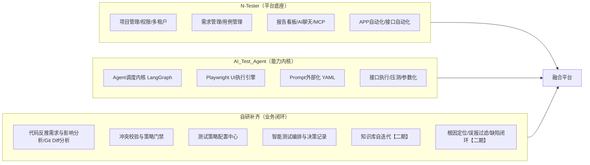
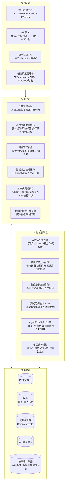
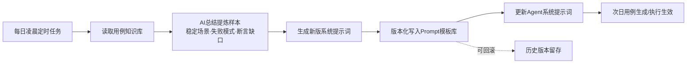
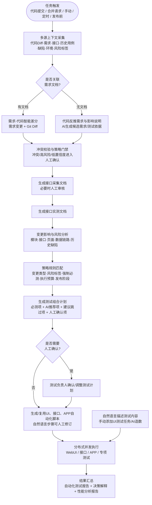
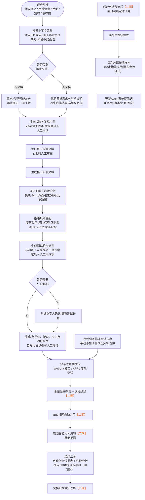
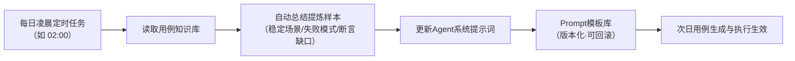
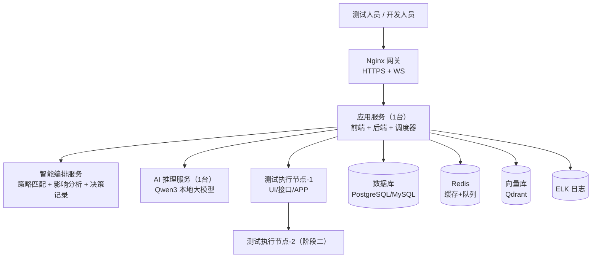
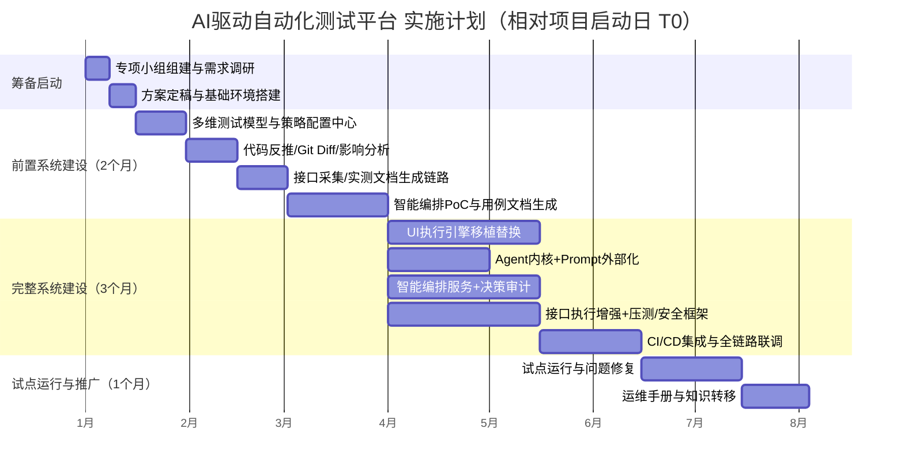

# AI驱动自动化测试平台落地实施方案

> **技术路线**：以 N-Tester 为平台底座 + 深度融合 AI_Test_Agent 的 Agent 调度内核与 Playwright UI 执行引擎 + 自研补齐业务闭环
>
> **文档版本**：v1.2 ｜ **状态**：待评审  
>
> 目录

1. [项目概述](#1-%E9%A1%B9%E7%9B%AE%E6%A6%82%E8%BF%B0)
2. [总体技术路线：混合自研](#2-%E6%80%BB%E4%BD%93%E6%8A%80%E6%9C%AF%E8%B7%AF%E7%BA%BF%E6%B7%B7%E5%90%88%E8%87%AA%E7%A0%94)
3. [目标架构设计](#3-%E7%9B%AE%E6%A0%87%E6%9E%B6%E6%9E%84%E8%AE%BE%E8%AE%A1)
4. [功能模块规划](#4-%E5%8A%9F%E8%83%BD%E6%A8%A1%E5%9D%97%E8%A7%84%E5%88%92)
5. [核心业务流程设计](#5-%E6%A0%B8%E5%BF%83%E4%B8%9A%E5%8A%A1%E6%B5%81%E7%A8%8B%E8%AE%BE%E8%AE%A1)
6. [融合改造清单（落地核心）](#6-%E8%9E%8D%E5%90%88%E6%94%B9%E9%80%A0%E6%B8%85%E5%8D%95%E8%90%BD%E5%9C%B0%E6%A0%B8%E5%BF%83)
7. [数据与存储设计](#7-%E6%95%B0%E6%8D%AE%E4%B8%8E%E5%AD%98%E5%82%A8%E8%AE%BE%E8%AE%A1)
8. [部署方案与资源需求](#8-%E9%83%A8%E7%BD%B2%E6%96%B9%E6%A1%88%E4%B8%8E%E8%B5%84%E6%BA%90%E9%9C%80%E6%B1%82)
9. [实施计划与里程碑](#9-%E5%AE%9E%E6%96%BD%E8%AE%A1%E5%88%92%E4%B8%8E%E9%87%8C%E7%A8%8B%E7%A2%91)
10. [风险管理与应对](#10-%E9%A3%8E%E9%99%A9%E7%AE%A1%E7%90%86%E4%B8%8E%E5%BA%94%E5%AF%B9)
11. [验收标准与质量指标](#11-%E9%AA%8C%E6%94%B6%E6%A0%87%E5%87%86%E4%B8%8E%E8%B4%A8%E9%87%8F%E6%8C%87%E6%A0%87)
12. [附录](#12-%E9%99%84%E5%BD%95)

***

## 1. 项目概述

### 1.1 背景与痛点

当前测试团队面临的核心矛盾：

| 痛点 | 具体表现 | 影响 |
| --- | --- | --- |
| 人力资源瓶颈 | 仅 2 名测试人员需支撑十几个核心业务系统，任务量持续增长而资源投入刚性 | 任务积压风险上升，交付节奏受制约 |
| AI 生成代码质量风险 | 生成代码存在逻辑疏漏、命名不规范、冗余堆砌，可能引入未验证依赖、硬编码密钥、SQL 注入、版权复用风险 | 质量风险隐蔽，需更强的测试保障 |
| 测试覆盖度不足 | 手工编写用例效率低，边界与异常场景覆盖不全 | 质量风险难以提前暴露 |
| 流程缺失 | 变更影响分析、测试策略选择、用例/脚本生成、执行与报告链路依赖人工，缺少可配置的自动化决策闭环 | 版本快速交付受阻 |

### 1.2 建设目标

构建以 AI 为核心的自动化测试平台，实现：

- **多模式触发**：即时/定时/代码提交等多种任务触发方式
- **多源上下文输入**：需求文档、代码 Diff、接口定义、历史用例、缺陷记录、运行环境与变更风险共同作为测试决策依据；需求文档缺失时再启用代码反推
- **多维测试建模与智能编排**：不把测试能力限制在单一层次分类中，而是从测试层级、被测对象、测试目标、质量属性、执行方式、测试范围、触发阶段等多个维度描述测试资产，由规则引擎与 AI 自动组合测试计划
- **变更影响驱动执行**：开发提交代码后，平台先分析变更影响和风险，再决定本次执行哪些测试，不默认每次都跑完整单元/集成/系统测试
- **规则兜底 + AI 推荐 + 人工门禁**：强制必测项由规则引擎保障，AI 负责扩展推荐与理由说明，高风险/低置信度场景进入人工确认
- **测试策略可配置**：支持按变更类型、风险标签、发布阶段、执行成本、环境限制配置测试策略，让平台可以从“自动执行”逐步演进到“可信自动决策”
- **并行执行与持续反馈**：静态分析、影响分析、用例生成、脚本生成和动态执行尽量并行；执行结果反哺知识库、策略规则和 Prompt
- **知识库自迭代** <span style="color:#e8590c">【二期】</span>：每日定时任务自动总结测试样本，动态更新 Agent 系统提示词
- **全链路闭环**：
  - 一期：任务触发 → 多源上下文采集 → 变更影响分析 → 策略规则匹配 → 测试组合计划 → 自动化脚本 → 执行 → 报告
  - <span style="color:#e8590c">【二期】</span>：任务触发 → 智能编排 → 执行 → 根因定位/误报过滤 → 缺陷流转 → 资产沉淀 → 知识库自迭代


### 1.3 预期收益

| 指标 | 目标值 |
| --- | --- |
| 整体测试效率提升 | ≥ 70% |
| 功能测试时间缩短 | ≥ 70% |
| 测试覆盖率 | ≥ 90% |
| 缺陷预测准确率提升 | ≥ 50% |
| 用例准备效率提升 | ≥ 80% |

> 远期收益：推动测试岗从"执行者"向"质量策略设计者"升级，缺陷精准检出聚焦高风险区，全链路可观测可追溯，智能顾问辅助决策。

### 1.4 建设分期：一期与二期

| 分期 | 范围 | 说明 |
| --- | --- | --- |
| **一期**（先落地） | 需求解析/代码反推、接口采集/实测文档、多维测试资产建模、变更影响分析、测试策略配置、测试计划自动编排、UI/接口/APP 自动化执行、报告看板、系统管理、阶段一部署 | 闭环"变更/需求→影响分析→策略匹配→测试计划→执行→报告" |
| **二期**（后建设） | 知识库自迭代、根因定位与误报过滤、缺陷智能闭环流转、测试资产沉淀、策略自优化 | 深化智能闭环 |

***

## 2. 总体技术路线：混合自研

### 2.1 三条路线对比回顾

| 维度 | AI_Test_Agent 二次开发 | N-Tester 二次开发 | 完全自研 |
| --- | --- | --- | --- |
| 平台完整性 | 弱（缺权限、APP 自动化、需求管理等业务模块） | 强（需求-用例-脚本-报告链路完整） | — |
| 执行引擎 | 强（ActionStep 确定性执行、多 Selector 回退、录制健壮化） | 中（有录制回放但精细度不足） | — |
| Prompt 配置化 | 强（YAML 外部化，修改无需重启） | 中（有提示词模板管理，无懒加载机制） | — |
| 开发周期 | 需自建大量业务层 | 短（平台功能开箱即用） | 极长（全部模块从零开发） |
| 风险 | 业务闭环需大量自建 | 模块耦合度高、需侵入源码 | 工程坑全部自扛 |

**结论**：以 **N-Tester 为整体开发框架**，深度融合 **AI_Test_Agent 的 Agent 调度内核与 Playwright UI 执行引擎**，继承其 **Prompt 外部化配置能力**，进行**模块化二次开发**。

### 2.2 融合策略总览



| 来源 | 保留/吸收内容 | 策略 |
| --- | --- | --- |
| **N-Tester（底座）** | 前后端工程骨架（FastAPI + Vue3）、用户/角色/权限/业务线、项目管理、需求管理、用例管理、报告看板、AI 聊天助手、MCP 集成、APP 自动化、知识库 RAG | 直接复用，保留数据模型与 API 规范，按需改造 |
| **AI_Test_Agent（内核）** | Agent 调度内核（LangGraph）、Playwright UI 执行引擎（ActionStep/录制器/健壮化/多 Selector 回退/BrowserPool）、Prompt 模板外部化（YAML + 懒加载）、接口执行引擎（参数化/CSV 驱动/压测）、统一 LLM 客户端 | 代码级移植进 N-Tester 对应服务层，替换/增强其原生实现 |
| **自研补齐** | 代码反推需求与影响说明、Git Diff 智能差分、冲突校验与策略门禁、多维测试属性、测试策略配置中心、智能测试编排与决策记录、接口采集/实测文档生成链路（一期）；知识库自迭代、根因自动定位、误报过滤、缺陷智能闭环流转（二期） | 全新开发，对齐 PPT 核心流程，并补齐“AI 如何判断、如何配置、如何可解释”的落地机制 |

### 2.3 技术栈基线

| 层 | 技术选型 | 说明 |
| --- | --- | --- |
| 后端框架 | Python 3.11+ / FastAPI + Uvicorn | 全异步 ASGI |
| ORM | Tortoise ORM（N-Tester 现状） | 保留，必要时引入 SQLAlchemy 兼容层 |
| Agent 编排 | LangGraph + LangChain | 移植 ai_test_agent 的 agent/core.py 编排逻辑 |
| 浏览器自动化 | Playwright （Python） | 移植 ai_test_agent 执行引擎 |
| 接口执行 | httpx（异步） | 移植 ai_test_agent api_executor |
| 任务调度 | APScheduler | Cron 定时 + 重启恢复 |
| 任务队列 | Redis（可选） | 多 Worker 持久化队列 |
| 数据库 | PostgreSQL | 存储数据 |
| 向量库 | Qdrant（N-Tester 现状）/ pgvector | RAG 检索 |
| 认证 | JWT + bcrypt | 保留 |
| 前端 | Vue 3 +  Element Plus +  ECharts | 保留 |
| 实时通信 | WebSocket | 全流程进度推送 |
| 大模型 | 本地 Qwen3（27B Q4） | 统一 LLM 客户端 |

> **许可合规**：两个项目均为 **MIT 协议**，允许修改、商用与闭源发布，仅需保留版权声明。自研融合不存在法律障碍，但需在代码中保留原协议声明（详见第 10 章）。

### 2.4 核心技术对比：ORM 与向量库

#### 2.4.1 ORM 技术选型对比

**现状**：N-Tester 使用 **Tortoise ORM**（异步原生，aerich 迁移）；AI_Test_Agent 使用 **SQLAlchemy 2.0**。两套 ORM 在各自仓库均已跑通，是本项目可选的两种基线。

| 维度 | Tortoise ORM | SQLAlchemy 2.0 | SQLModel | Django ORM | Ormar | Piccolo |
| --- | --- | --- | --- | --- | --- | --- |
| 异步支持 | 原生异步（asyncpg/aiomysql） | 原生异步（2.0起），AsyncSession 完整支持 ORM 功能 | 继承 SQLAlchemy 2.0 异步能力，基于 AsyncSession 封装 | Django 4.1+ 部分异步，ORM 核心仍同步，FastAPI 中需 sync_to_async | 原生异步，专为 FastAPI 设计 | 原生异步 |
| 生态 / 社区 | 较小（5.5k+ stars），更新节奏慢 | Python ORM 事实标准（11.7k+ stars） | 较新，FastAPI 作者维护 | Django 框架内置，生态极大，但脱离 Django 使用不便 | 较小，但定位明确（FastAPI mini ORM） | 较小 |
| 迁移工具 | aerich（基础够用） | Alembic（成熟） | Alembic | 内建 migrations 系统，功能成熟，支持 squashing | 依赖 Alembic | Piccolo migrations |
| 复杂查询能力 | 中等（子查询/窗口函数较弱） | 强（CTE/窗口函数/复杂聚合） | 同 SQLAlchemy | 强，支持聚合、annotate、子查询，但复杂 SQL 不如 SQLAlchemy 灵活 | 中等，mini ORM 定位，复杂查询需要 raw SQL | 中等 |
| 与 FastAPI 契合 | 好（Django 风格 API，一行跨表查询） | 好（async session 成熟） | 最好（Pydantic 融合） | 差，Django ORM 与 FastAPI 集成需要额外包装，官方不推荐 | **好**，模型可直接用作 response_model，Pydantic 原生融合 | 好 |
| 学习成本 | 低 | 中高（Data Mapper 模式） | 低 | 中，如果熟悉 Django 则低，反之需学一套框架 | 低，API 极简，但生态小 | 低 |
| 切换成本（自现状） | —（现状） | 中（重写全部 models + 数据访问 + 迁移链） | 高 | 高 | 中 | 高 |

**结论与建议**：

- **保留 Tortoise ORM**：① 异步原生，对"项目管理平台"这类以 CRUD + 简单聚合为主的场景能力完全够用；② N-Tester 的 models/services 全部绑定 Tortoise，切换 = 重写全部数据访问层与迁移链（估算 4 周）。
- **切换 SQLAlchemy 2.0 + Alembic**：出现强复杂查询需求（窗口函数、CTE、跨库聚合），或需要与 ai_test_agent 数据层深度复用（两仓库统一 ORM 减少心智负担）时再切——SQLAlchemy 是唯一值得的切换目标。
- **低成本保险措施（推荐）**：新代码统一走 **Repository/DAO 数据访问层**，业务逻辑不直接依赖 ORM API；未来切换只替换 DAO 实现，不动业务层。

#### 2.4.2 向量库技术选型对比

**现状**：N-Tester 默认 **Qdrant**，AI_Test_Agent 默认 **pgvector**（不可用时自动降级关键词匹配）。RAG 服务层已集中封装（入库/检索/删除/集合管理），**切换只改 adapter，前端零改动**。

| 方案 | 定位 | 推荐规模上限 | 部署形态与环境要求 | 运维成本 | 切换成本 |
| --- | --- | --- | --- | :---: | :---: |
| **Qdrant**（现状） | 轻量高性能 | 百万～亿级 | 单 Docker 容器；内存约 200MB～1GB 起；支持量化压缩与混合检索 | 低 | — |
| **pgvector**（可选） | PG 扩展 | 单机 ≤1000 万 | 随 PostgreSQL，零新增组件（CREATE EXTENSION vector）；高维 HNSW 内存占用大 | 极低 | 低 |
| **Milvus** | 分布式大规模 | 千万～百亿级 | Standalone：≥8G 内存 / 4 核 / 50GB SSD / Docker 20.10+；分布式需 etcd+MinIO；GPU 版需 NVIDIA 驱动 + CUDA | 高 | 中 |
| **Weaviate** | 灵活 schema | 千万级 | Docker 容器，GraphQL 接口 | 中 | 中 |
| **Elasticsearch** | 复用搜索基建 | 千万级 | JVM 堆内存需专门规划（生产建议 8G+） | 高 | 中 |
| **Chroma** | 原型验证 | 百万以下 | 嵌入式进程内库，无独立服务 | 极低 | 低 |
| **Pinecone** | 托管云 | 亿级 | 全托管，数据出域 | 零（托管费） | 不适用（私有化） |

**结论与建议**：

- **阶段一保持 Qdrant**：单容器、内存友好、支持混合检索，规模上限（百万～亿级）。
- **升级触发条件**：向量规模上千万、需要 GPU 加速、多副本高可用 → 评估 Milvus；公司已有 ES 基建且希望统一日志 + 检索 → 可接 ES，否则不单独引入。
- **关键提醒**：检索效果主要由 **embedding 模型**决定（换 embedding 需全量重建索引，影响远大于换向量库）；两个开源项目均内置向量库不可用时的关键词降级兜底，切换失败不会中断主流程。

***

## 3. 目标架构设计

### 3.1 四层架构总览

对齐 PPT 第 6 页的"分层解耦架构"，落到具体组件：



| 层 | 核心组件 | 来源 | 核心职能 |
| --- | --- | --- | --- |
| 接入层 | Web 门户、API 网关、认证中心、任务调度 | N-Tester（保留）+ 自研（触发扩展） | 统一入口、鉴权、流量控制、任务触发 |
| 业务层 | 任务/用例管理、测试策略配置、测试计划编排、测试集群、报告引擎 | N-Tester（保留）+ ai_test_agent（执行集群移植）+ 自研（策略与编排） | 需求拆解、策略配置、测试计划编排、执行调度、知识沉淀、报告生成 |
| 智能引擎层 | 静态分析、变更影响分析、智能测试编排、用例生成 Agent、提示词迭代、根因分析 | ai_test_agent（Agent 内核）+ 自研（影响分析/编排/反推/迭代/根因） | AI 负责影响识别、测试推荐、决策解释与持续优化 |
| 数据层 | PostgreSQL/MySQL、Redis、向量库、ELK、决策审计数据 | N-Tester（保留）+ 自研新增表 | 持久化、缓存、向量检索、日志治理、策略与编排过程可追溯 |

### 3.2 关键技术设计

#### 3.2.1 Agent 调度内核（吸收 ai_test_agent）

- **LangGraph 工作流状态机**：将"多源上下文采集 → 变更影响分析 → 策略规则匹配 → 测试组合计划 → 用例/脚本生成 → 执行调度 → 报告分析"编排为可回放、可中断、可重试的图结构。
- **AgentState 按 task_id 隔离**：每个测试任务独立状态上下文，避免多任务并发互相污染。
- **工具注册机制**：LangChain Tool 统一注册（代码差分解析、需求解析、接口解析、影响分析、用例生成、脚本执行、报告分析等工具），LLM 按需调用。
- **职责边界**：核心测试功能（确定性执行）不依赖 Agent；强制必测项由规则引擎兜底，Agent 负责"为什么测、测哪些、如何组合"，保证执行可靠性与决策可解释。

> 移植文件参考：`agent/core.py`（UITestAgent 任务编排）、`agent/langgraph_agent.py`（LangGraph 编排初始化）。

#### 3.2.2 Playwright UI 执行引擎（吸收 ai_test_agent）

以 **ActionStep 统一数据模型** 为核心，串联录制、AI 生成、执行三段链路：

| 能力 | 设计要点 |
| --- | --- |
| ActionStep 统一模型 | 22 种 action 类型；字段含 action/selector/selectors（候选回退列表）/value/expected/optional 等 |
| 录制器 | 有头浏览器 JS 事件注入 + 200ms 轮询；SPA 路由双路保障（MutationObserver + popstate/hashchange）；智能步骤补全（登录/提交/导航） |
| 步骤健壮化 | Selector A/B/C/D 四级评级；多候选推导；关键操作后自动插入 wait + assert |
| 多 Selector 回退 | 执行时逐候选探测（wait_for_selector 2s），应对动态 id / 框架重构 |
| 登录态快照 | storage_state 复用 + TTL 自动刷新，批量执行零耗时建会话 |
| 多浏览器并行 | 同一批用例 Chromium/Firefox/WebKit 并行执行，各出报告 |
| 并发保护 | BrowserPool Semaphore(6)；同任务执行/录制双锁防重复触发（409） |
| 控制流 | if/else/while 步骤级控制流，ast 白名单安全求值 |

> 移植文件参考：`skills/action_runner.py`、`skills/recorder.py`、`skills/step_hardener.py`、`skills/test_executor.py`、`skills/parallel_runner.py`、`skills/control_flow.py`、`tools/browser.py`、`tools/action_schema.py`。

#### 3.2.3 Prompt 模板外部化与自迭代（吸收 + 自研增强）【一期＋二期】

- **外部化**（一期）：所有 LLM Prompt 统一存放于 `skills/prompts/*.yaml`，按场景分文件（用例生成/场景规划/接口用例/代码分析等）。
- **懒加载 + LRU 缓存**（一期）：修改 YAML 后下次调用自动生效，**无需重启服务**，调优不改代码。
- **自研增强——系统提示词自迭代** <span style="color:#e8590c">【二期】</span>：
    - 每日凌晨定时任务（如 02:00）
    - 读取用例知识库（执行结果、缺陷记录、用例变更日志）
    - AI 自动总结提炼样本：哪些场景稳定、哪些断言缺失、哪些步骤易失效
    - 生成新的 Prompt 版本写入模板库（版本化、可回滚）
    - 更新 Agent 系统提示词，次日生效



> 移植文件参考：`skills/prompt_loader.py`（YAML 加载器）、`skills/prompts/*.yaml`（模板样例）。

#### 3.2.4 多模式触发与多源上下文（自研）

- **触发方式**：代码提交触发（Git Webhook）、手动触发、定时触发（Cron）。
- **上下文聚合**：触发后系统聚合需求文档、代码 Diff、接口定义、历史用例、缺陷记录、执行日志、环境配置与风险标签，作为本次测试计划的决策输入。
- **需求来源判断**：系统自动检测任务是否关联需求文档：

    - **有文档** → 智能差分分析（Git Diff + 需求变更对比）
    - **无文档** → 代码反推需求与影响说明，作为候选测试依据；高风险或低置信度时进入人工确认，普通变更自动继续

#### <span style="color:#e8590c">3.2.5 知识库自迭代闭环（自研）【二期】</span>

见 3.2.3 自迭代流程 + 第 5.2 节。核心：把"执行结果/缺陷数据/用例变更"作为样本输入，反向优化 Agent 提示词与用例库，形成**测试资产持续增值**的飞轮。

#### 3.2.6 执行引擎职责分离（吸收 ai_test_agent 设计理念）

| 引擎 | 特性 | 并发模型 |
| --- | --- | --- |
| UI 执行引擎（Playwright） | 依赖浏览器状态，天然串行 | BrowserPool 信号量控制，多浏览器并行 |
| 接口执行引擎（httpx） | 纯 HTTP，天然并发 | 异步并发 + 压测模式（TPS/P95/P99） |

> 强行为 UI 和接口设计统一抽象会互相污染，保持两类引擎独立演进。

#### 3.2.7 只读模式与并行执行

- 测试执行以只读模式运行，全程不修改被测代码与环境。
- 静态分析（代码/需求）与动态执行（UI/接口）并行，兼顾效率与安全。
- 分布式执行节点可动态增减，7×24 小时运行。

#### 3.2.8 多维测试模型与资产描述

平台不采用“单元测试 → 集成测试 → 系统测试”的单一树状分类来限制测试范围。用户列出的测试类型实际包含多个不同维度，平台应采用**多维测试模型**：一个测试用例可以同时拥有多个标签，一个测试计划可以根据变更风险动态组合不同类型的测试。

| 维度 | 典型取值 | 说明 |
| --- | --- | --- |
| 测试层级/作用域 | 单元、组件、集成、系统、端到端 | 描述测试覆盖的范围和依赖边界 |
| 测试目标 | 功能、流程、业务规则、场景、界面、接口、数据、报表、批处理、工作流 | 描述要验证的业务或技术目标 |
| 质量属性 | 性能、安全、可靠性、可用性、兼容性、可维护性、隐私合规、数据一致性、灾备恢复等 | 描述质量风险类型，允许多选 |
| 被测对象 | API、UI、数据库、中间件、基础设施、消息链路、模型、RAG、工具调用 | 描述测试针对的对象 |
| 执行方式 | 手工、自动化、半自动化、探索性、随机、模糊、猴子、灰度、金丝雀等 | 描述测试如何执行 |
| 测试范围/策略 | 冒烟、Sanity、回归、验收、专项、全量、增量 | 描述本次选择的测试范围和用途，不与测试层级混为一类 |
| 触发阶段 | 代码提交、合并请求、合并后、部署后、定时、发布前、人工触发 | 描述何时执行 |
| AI/本地模型专项 | 效果、幻觉、偏见毒性、提示注入、越狱、RAG、工具调用、多轮、长上下文、推理性能、显存、量化、漂移、成本等 | 当被测对象包含模型或 AI 链路时启用的领域标签 |

**分类关系需要特别说明**：

1. 单元、集成、系统、端到端更接近“测试层级”。
2. 功能、流程、业务规则、接口、数据属于“测试目标或被测对象”。
3. 性能、安全、可靠性、兼容性属于“质量属性”。
4. 冒烟、Sanity、回归、验收通常描述测试范围、阶段或质量门禁，不应和单元测试放在同一层级。
5. 手工、自动化、探索性、模糊测试描述执行方式。模型幻觉、提示注入、RAG、工具调用属于 AI 专项领域。

因此，平台不要求一个用例只能归入某一个分类，而是保存结构化属性。例如：

```yaml
test_level: integration
targets: [api, database, message_queue]
objectives: [functional, data_consistency]
quality_attributes: [reliability]
scope: [smoke, regression]
execution_mode: automated
trigger_stage: [pull_request, post_deploy]
```

同一个“支付下单”用例可以是集成级测试，也可以属于 API 测试、业务流程测试、数据一致性测试和回归测试。平台应按属性筛选和组合测试计划，而不是强行把它放进某一个目录。

#### 3.2.9 变更影响驱动的智能测试编排

开发提交代码后，平台不直接默认执行某一种传统测试，而是采用“**确定性规则兜底 + AI 变更分析推荐 + 人工策略控制**”的混合决策机制。

**决策输入**：

- Git Diff、提交说明、分支/合并请求信息和变更文件类型
- 代码依赖图、调用链、服务边界、接口定义、数据库 Schema、消息主题与配置变化
- 关联需求文档、接口文档、历史用例、历史缺陷和最近失败模式
- 被测环境、可用执行器、测试数据、测试成本、预计耗时和当前发布阶段
- 业务风险标签，例如登录、权限、支付、订单、数据迁移、隐私和安全相关变更

**决策输出**：

- 受影响的模块、接口、页面、数据链路和业务场景
- 必须执行的测试集合、AI 推荐的扩展测试集合、建议跳过的测试集合
- 每项测试的选择理由、风险等级、预计耗时、执行环境和依赖条件
- 测试计划的置信度。低置信度或高风险场景进入人工确认

**执行原则**：

1. 规则引擎定义不可跳过的最低质量门禁，AI 不得绕过必测项。
2. AI 可以根据变更影响扩展测试范围，但不能仅凭自然语言判断就跳过安全、数据迁移、权限等强制测试。
3. 测试平台优先执行“受影响范围测试”，再根据风险和成本决定是否升级到更大范围。
4. 全量系统测试、破坏性测试、生产近似压测、混沌测试和正式验收默认需要发布阶段或人工批准。
5. 每次选择结果都要记录决策依据，便于复盘 AI 漏测、误测和测试策略调整。

**典型变更与最低测试集合**：

| 变更类型 | 平台应自动识别的影响 | 最低必测集合 | AI 可扩展的测试 |
| --- | --- | --- | --- |
| 内部函数或单一模块逻辑变更 | 受影响函数、组件和直接调用方 | 静态检查 + 受影响单元/组件测试 | 边界、异常、历史缺陷回归 |
| API、接口契约或序列化结构变更 | 调用方、上下游服务和接口文档 | 单元/组件 + 契约测试 + 受影响集成测试 | 跨服务流程、兼容性、数据一致性 |
| 数据库 Schema、迁移脚本或消息结构变更 | 数据读写、消费者、回滚链路 | 迁移校验 + 数据一致性 + 集成测试 | 历史数据回放、灾备/回滚验证 |
| UI 页面、路由或权限逻辑变更 | 页面组件、接口调用和核心用户路径 | UI 冒烟 + 接口集成 + 权限相关测试 | 端到端流程、浏览器兼容性、可访问性 |
| 登录、权限、支付、订单等高风险变更 | 关键业务链路和安全边界 | 功能回归 + 安全测试 + 核心端到端测试 | 越权、注入、异常恢复、历史缺陷集 |
| 配置、基础设施或部署脚本变更 | 环境、服务启动、网络和资源配置 | 部署后冒烟 + 健康检查 + 回滚验证 | 兼容性、稳定性、容量和灾备测试 |
| Prompt、模型、RAG 或工具调用链变更 | 模型输出、知识检索和外部工具行为 | AI 效果回归 + 安全对齐/提示注入检查 | 幻觉、越狱、长上下文、并发推理、成本和漂移测试 |

平台的默认行为因此应当是**变更影响驱动的最小充分测试**，而不是“每次提交默认单元测试”或“每次提交默认全量测试”。

#### 3.2.10 测试策略配置与质量门禁

为了避免 AI 决策不可控，平台需要提供可配置的测试策略中心。策略中心定义“哪些场景必须测、哪些场景可以由 AI 推荐、哪些场景必须人工确认”，并把规则结果与 AI 推荐结果合并为最终测试计划。

| 配置项 | 配置内容 | 作用 |
| --- | --- | --- |
| 变更类型规则 | 文件路径、代码类型、接口契约、数据库脚本、配置、Prompt、模型链路等变更匹配规则 | 判断本次提交属于哪类变更 |
| 风险标签 | 登录、权限、支付、订单、数据迁移、隐私、安全、核心报表、批处理等业务/技术风险 | 给模块、接口、页面、流程和用例打风险标签 |
| 强制必测规则 | 高风险模块、接口契约、数据库迁移、权限、安全、发布前核心链路等最低测试集合 | 作为 AI 不允许跳过的质量底线 |
| AI 推荐阈值 | 置信度阈值、风险等级阈值、推荐测试数量上限 | 控制 AI 推荐是否自动采纳 |
| 执行成本预算 | 单次提交最大耗时、最大用例数、最大并发数、是否允许压测/全量回归 | 避免每次提交都演变成全量测试 |
| 发布阶段策略 | 提交阶段、合并请求、合并后、部署后、定时巡检、发布前 | 不同阶段使用不同测试范围和门禁 |
| 人工审批策略 | 高风险、低置信度、生产近似压测、破坏性测试、全量系统测试、正式验收 | 明确哪些计划必须测试负责人确认 |
| 测试资产标签 | 测试层级、被测对象、测试目标、质量属性、执行方式、测试范围、触发阶段 | 让用例、脚本、报告可按多维属性检索和组合 |
| 历史缺陷关联 | 缺陷与模块、接口、页面、数据链路、风险标签关联 | 让 AI 在类似变更时自动推荐历史缺陷回归 |
| 环境策略 | 不同环境可执行的测试类型、数据隔离、账号权限、第三方依赖开关 | 防止测试误伤环境或产生不可控成本 |

**策略合并顺序**：

1. 规则引擎先生成强制必测项。
2. AI 根据影响范围、历史缺陷和风险标签生成推荐项。
3. 系统按执行预算、环境策略和发布阶段裁剪推荐项。
4. 高风险、低置信度或超预算计划进入人工确认。
5. 最终计划写入决策记录，供报告、审计和后续复盘使用。

#### 3.2.11 AI 决策可解释与人工确认机制

智能测试编排不能只输出“执行/不执行”的结果，必须输出可解释的判断依据。每一次自动编排都需要保留决策记录。

| 决策内容 | 说明 |
| --- | --- |
| 影响范围 | 受影响模块、接口、页面、数据库表、消息主题、业务流程 |
| 测试集合 | 必测项、AI 推荐项、建议跳过项、人工确认项 |
| 选择理由 | 代码 Diff、需求变更、历史缺陷、风险标签、调用链、接口契约变化 |
| 风险等级 | 低/中/高，或按 P0-P3 风险等级 |
| 置信度 | AI 对影响范围和测试推荐的置信度 |
| 执行成本 | 预计耗时、用例数量、执行节点、是否占用压测资源 |
| 审批记录 | 审批人、审批时间、调整内容、驳回原因 |
| 复盘结果 | 是否发现缺陷、是否漏测、推荐项是否有效、策略是否需要更新 |

人工确认不应成为默认阻塞点，而是策略门禁的一部分：

- **低风险 + 高置信度**：自动执行必测项和可接受成本内的推荐项。
- **中风险**：自动执行必测项，推荐项按项目策略自动执行或等待确认。
- **高风险**：执行计划进入测试负责人确认，确认后再运行。
- **低置信度**：进入人工确认，确认结果反哺 Prompt 和规则库。
- **破坏性/高成本测试**：如生产近似压测、全量兼容矩阵、混沌工程，默认人工确认。

***

## 4. 功能模块规划

### 4.1 需求管理模块（N-Tester 基础 + 自研增强）

| 功能 | 来源 | 说明 |
| --- | --- | --- |
| 需求文档上传/在线编辑/版本管理 | N-Tester | Word/PDF/Markdown 多格式 |
| AI 需求拆分/评审/语义检索 | N-Tester | RAG 增强 |
| **代码反推需求与影响说明** | 自研 | 无文档时 AI 逆向生成候选需求、影响范围和测试依据；高风险或低置信度时人工确认，普通变更自动继续 |
| **Git Diff 智能差分分析** | 自研 | 有需求文档，对增量代码进行梳理，判断标记和修改需求文档，自定义规则需求优先级判定，需求文档和代码冲突检测，进行异常标记留存 |
| **接口采集文档生成** | 自研 | 需求/代码解析 → 标准化接口采集文档（必要时审核） |
| **接口实测文档生成** | 自研 | 整合解析数据与冲突标记，输出全覆盖实测标准文档 |

### 4.2 用例管理模块（N-Tester + ai_test_agent 增强）

| 功能 | 来源 | 说明 |
| --- | --- | --- |
| 用例 CRUD / 模块树 / 等级（P0-P3）/ 步骤管理 | N-Tester | 保留 |
| 用例导入导出（Excel/XMind/Markdown） | 两者 | N-Tester 基础 + ai_test_agent 的 Excel 条件格式导出 |
| **多维测试属性** | 自研 | 用例维护测试层级、被测对象、测试目标、质量属性、执行方式、测试范围、触发阶段和风险标签，支持多标签组合 |
| **AI 用例生成（6 种测试方法）** | ai_test_agent | 等价类/边界值/判定表/场景法/错误推测/状态转换，分段并行生成 |
| **需求变更增量更新（AI Diff + 用例级合并）** | ai_test_agent | 仅更新变更模块，deprecated 单独存储 |
| **需求追踪矩阵** | ai_test_agent | 用例-需求双向映射、覆盖率可视化、缺口分析补用例 |
| 离线批量生成/在线实时生成 | N-Tester | 保留 |

### 4.3 自动化执行模块

| 子模块 | 来源 | 说明 |
| --- | --- | --- |
| WebUI 自动化 | ai_test_agent（移植替换） | AI 场景规划 → 录制 → 健壮化 → 执行；可视化步骤编辑器；多浏览器并行 |
| 接口自动化 | N-Tester（基础）+ ai_test_agent（增强） | 多来源用例（Swagger/Curl/自然语言/代码/Postman/HAR）；参数化三层变量池；CSV 数据驱动；压测 |
| APP 自动化（需连接手机） | N-Tester | Appium 集成、设备管理 |
| 脚本生成 | 两者 | 一键生成 Pytest/Unittest/TestNG 脚本，自然语言操作描述（使用playwright ），可人工介入 |
| 测试计划与智能编排 | 自研 | 根据代码变更影响、风险、测试成本、环境和发布阶段动态组合测试计划，支持冒烟、增量回归、全量回归和发布前验收 |
| 定时/并发执行 | N-Tester + ai_test_agent | Cron 定时、分布式并发、WebSocket 实时进度 |
| 安全测试 | ai_test_agent（移植） | 渗透扫描引擎 12 模块，AI 修复建议（仅授权场景） |
| 压测与性能分析 | <span style="color:#e8590c">自研 【二期】</span> | 并发/时长/爬坡策略，TPS/P95/P99 实时指标，性能分析报告 |

### 4.4 智能测试编排模块（自研核心）

| 功能 | 说明 |
| --- | --- |
| 多源上下文采集 | 聚合代码 Diff、提交说明、需求文档、接口定义、历史用例、缺陷记录、执行日志、环境配置和风险标签 |
| 变更类型识别 | 自动识别内部逻辑、API 契约、数据库、UI、权限、安全、配置、Prompt/RAG/模型链路等变更类型 |
| 变更影响分析 | 分析受影响模块、接口、页面、数据链路、消息主题、上下游服务和核心业务流程 |
| 策略规则匹配 | 匹配变更类型规则、风险标签、强制必测规则、发布阶段策略和环境策略 |
| 测试组合计划生成 | 输出必测项、AI 推荐项、建议跳过项、人工确认项，并给出理由、风险等级、置信度和预计耗时 |
| 策略门禁与审批 | 高风险、低置信度、超预算、破坏性/高成本测试进入人工确认，普通变更自动执行 |
| 执行成本控制 | 控制单次提交最大执行耗时、最大用例数、最大并发数、压测/全量回归开关 |
| 决策记录与复盘 | 保存影响范围、选择理由、AI 置信度、审批记录、执行结果和漏测复盘数据 |

### 4.5 智能分析模块（自研为主）【一期＋二期】

| 功能 | 说明 |
| --- | --- |
| 数据采集与误报过滤 <span style="color:#e8590c">【二期】</span> | 全链路采集测试/性能数据，AI 智能过滤环境类误报，锁定真实缺陷 |
| 根因自动定位 <span style="color:#e8590c">【二期】</span> | 解析调用链路与堆栈信息，定位代码问题点位，输出标准化根因与修复建议 |
| 多维质量报告 | 可视化报告、代码健康度量化、Bug 成因/影响范围/修复方案分析 |
| 趋势分析 | 历史执行数据对比、失败原因统计 |

### 4.6 缺陷闭环流转（自研）<span style="color:#e8590c">【二期】</span>

| 功能           | 说明                            |
| -------------- | ------------------------------- |
| 分级缺陷工单   | 自动创建 P0-P3 分级缺陷工单     |
| 智能推送协同   | 飞书 / 企微 / 钉钉 Webhook 推送 |
| 全流程联动管控 | 测开全流程联动，缺陷状态可追踪  |

### 4.7 知识库与自迭代（N-Tester 基础 + 自研）<span style="color:#e8590c">【二期】</span>

| 功能 | 来源 | 说明 |
| --- | --- | --- |
| 知识库创建/文档上传/分块向量化 | N-Tester | 多格式支持 |
| RAG 语义检索/混合检索 | 两者 | Qdrant 向量 + 关键词降级 |
| 每日自迭代任务 <span style="color:#e8590c">【二期】</span> | 自研 | 读取用例库 → 提炼样本 → 更新 Agent 提示词 |
| 测试资产沉淀 <span style="color:#e8590c">【二期】</span> | 自研 | 全量测试数据/用例/报告归档，支撑持续回归 |

### 4.8 系统管理模块（N-Tester +自研）

| 功能           | 说明                                         |
| -------------- | -------------------------------------------- |
| 用户管理       | 用户创建、编辑、删除与状态控制               |
| 角色权限       | RBAC 角色配置与权限分配                      |
| 业务线管理     | 业务线创建、用户绑定、数据隔离               |
| LLM 多厂商配置 | OpenAI / Azure / Claude / Gemini / Ollama 等 |
| MCP 服务器配置 | MCP 服务器接入与工具调用                     |
| 全局配置       | 提示词模板 / API 密钥 / Webhook / 执行预算  |
| 测试策略配置   | 变更类型规则、风险标签、强制必测规则、AI 推荐阈值、发布阶段策略、人工审批策略、环境策略 |
| 多租户工作空间 | 项目与人员数据隔离                           |

### 4.9 模块来源矩阵（总览）

| 模块 | N-Tester | AI_Test_Agent | 自研 |
| --- | :---: | :---: | :---: |
| 系统管理/权限/多租户 | ✅ 保留 | — | — |
| 项目管理/业务线 | ✅ 保留 | — | — |
| 需求管理（上传/拆分/评审） | ✅ 保留 | — | 增强：代码反推/Git Diff/冲突校验 |
| 接口采集/实测文档生成 | — | — | ✅ 全新开发 |
| 用例管理（CRUD/导入导出） | ✅ 保留 | ✅ Excel 增强 | — |
| 多维测试属性与智能编排 | — | — | ✅ 全新开发 |
| 测试策略配置与质量门禁 | — | — | ✅ 全新开发 |
| 变更影响分析与决策审计 | — | — | ✅ 全新开发 |
| AI 用例生成/增量更新/追踪矩阵 | — | ✅ 移植 | — |
| WebUI 自动化执行引擎 | 替换 | ✅ 移植（核心） | — |
| 接口自动化执行/压测 | 保留基础 | ✅ 增强移植 | — |
| APP 自动化 | ✅ 保留 | — | — |
| 安全测试（渗透） | — | ✅ 移植 | — |
| AI 聊天助手 | ✅ 保留 | — | — |
| MCP 集成 | ✅ 保留 | — | — |
| 知识库 RAG | ✅ 保留 | ✅ 检索增强 | — |
| 知识库自迭代<span style="color:#e8590c">【二期】</span> | — | — | ✅ 全新开发 |
| 根因定位/误报过滤<span style="color:#e8590c">【二期】</span> | — | — | ✅ 全新开发 |
| 缺陷闭环流转<span style="color:#e8590c">【二期】</span> | — | — | ✅ 全新开发 |
| Prompt 外部化 | 保留基础 | ✅ 移植（懒加载） | ✅ 自迭代增强 |
| 报告看板 | ✅ 保留 | ✅ 压测图表 | ✅ 性能报告 |

***

## 5. 核心业务流程设计

### 5.1 主流程：AI 驱动的测试闭环

#### 5.1.1 一期流程




#### 5.1.2 二期整体流程



**流程说明**：

| 步骤 | 环节 | 关键产出 | 人工介入点 |
| --- | --- | --- | --- |
| 01 | 任务触发与多源上下文采集 | 触发任务、代码 Diff、需求、接口、历史用例、缺陷、环境与风险标签 | 无 |
| 02 | 需求/代码差分与冲突校验 | 候选需求、需求差分、冲突标记、优先级判定 | 冲突/高风险/低置信度时确认处理方案 |
| 03 | 接口采集与实测文档生成 | 接口采集文档、接口实测标准文档 | 必要时审核 |
| 04 | 变更影响与风险分析 | 影响范围、风险等级、推荐测试维度 | 高风险/低置信度需确认 |
| 05 | 策略规则匹配 | 强制必测项、执行预算、发布阶段策略、环境限制 | 策略维护 |
| 06 | 测试组合计划生成 | 必测项、AI 推荐项、建议跳过项、人工确认项、选择理由 | 确认范围与优先级 |
| 07 | 脚本生成与并发测试 | UI/接口/APP 脚本 + 压测配置 + 执行计划 | 脚本确认/修改 |
| 08 | 数据采集与误报过滤【二期】 | 真实缺陷集 | 无 |
| 09 | 根因自动定位【二期】 | 根因 + 修复建议报告 | 确认 |
| 10 | 缺陷智能闭环流转【二期】 | 分级缺陷工单 | 确认分派 |
| 11 | 测试资产沉淀迭代【二期】 | 报告 + 决策记录 + 归档知识库 | 无 |
| 补充 | 手动 UI 测试任务 | 自然语言描述测试内容（如 AI 造数） | 手动添加 |
| 闭环 | 知识库自迭代【二期】 | 提炼样本更新提示词，反哺用例/脚本生成 | 无 |

### 5.2 代码提交后的自动编排策略

代码提交后，平台默认不固定执行某一个传统测试类型，而是按触发阶段、风险等级和执行成本生成不同范围的测试计划。

| 触发阶段 | 默认策略 | 自动执行内容 | 人工确认条件 |
| --- | --- | --- | --- |
| 代码提交 | 快速反馈，控制耗时 | 静态检查、受影响单元/组件测试、受影响 API/页面冒烟、历史缺陷轻量回归 | 涉及高风险标签、低置信度、影响范围无法确定 |
| 合并请求 | 验证变更可合并 | 必测项、契约测试、受影响集成测试、关键路径回归 | 权限/支付/数据迁移/安全相关变更 |
| 合并后/部署后 | 验证环境可运行 | 部署后冒烟、健康检查、核心流程、回滚校验 | 环境异常、依赖服务异常、数据库或配置变更 |
| 定时任务 | 巡检和稳定性发现 | 重点回归、稳定性巡检、历史失败重跑、知识库样本整理 | 大规模压测、混沌测试、全量兼容矩阵 |
| 发布前 | 质量门禁 | 核心回归、系统级端到端、关键安全项、性能基线、缺陷关闭验证 | 全量系统测试、生产近似压测、正式验收 |
| 手动任务 | 人工指定或补测 | 按用户选择范围执行，可调用 AI 推荐补充项 | 用户选择高成本/破坏性测试 |

**策略示例**：

```yaml
trigger_stage: pull_request
change_type: api_contract_change
risk_tags: [order, permission]
mandatory_tests:
  - api_contract_tests
  - affected_integration_tests
  - permission_regression_tests
recommended_tests:
  - core_order_e2e_flow
  - historical_bug_regression
manual_approval_required:
  - full_performance_test
execution_budget:
  max_duration_minutes: 30
  max_cases: 200
decision_policy:
  low_confidence_threshold: 0.75
  high_risk_requires_approval: true
```

### 5.3 后台自迭代流程 <span style="color:#e8590c">【二期】</span>



### 5.4 只读模式与并行执行（对齐 PPT 核心能力）

- 静态分析（代码反推、Git Diff、需求解析、影响分析）与动态执行（UI/接口/APP/专项测试）并行开展
- 全程只读，不修改被测代码与环境
- 分布式节点并发，7×24 小时运行
- 执行计划受策略中心控制，避免低风险提交触发高成本全量测试

***

## 6. 融合改造清单（落地核心）

### 6.1 改造总原则

1. **先跑通、后优化**：第一阶段以"能用的闭环"为目标，不追求完美架构。
2. **模块化侵入**：每个改造点独立成模块，通过服务层接口与 N-Tester 底座解耦，降低回归风险。
3. **保留数据模型**：N-Tester 的 Tortoise ORM 模型与迁移链（aerich）不动，新增字段走新增表/新增列。
4. **双库兼容**：改造代码保持 PostgreSQL/MySQL 双兼容。

### 6.2 改造点清单（按优先级）

| # | 改造模块 | 落地方式 | 参考实现（来源） | 核心工作内容 | 优先级 |
| --- | --- | --- | --- | --- | :---: |
| 1 | **UI 执行引擎替换** | 代码移植 | ai_test_agent：`skills/action_runner.py`、`skills/recorder.py`、`skills/step_hardener.py`、`tools/browser.py`、`tools/action_schema.py` | 将 ActionStep 模型、录制器、健壮化、多 Selector 回退、BrowserPool 迁入 N-Tester `services/aitestrebort`，替换原生 UI 执行 | **P0** |
| 2 | **Agent 调度内核** | 代码移植 + 适配 | ai_test_agent：`agent/core.py`、`agent/langgraph_agent.py` | 引入 LangGraph 编排，AgentState 按任务隔离；与 N-Tester 现有 LangChain 依赖版本对齐 | **P0** |
| 3 | **Prompt 外部化** | 代码移植 | ai_test_agent：`skills/prompt_loader.py`、`skills/prompts/*.yaml` | YAML 加载器（懒加载+LRU）；梳理 N-Tester 现有提示词入模板库；接入 LLM 配置页 | **P0** |
| 4 | **统一 LLM 客户端** | 代码移植 | ai_test_agent：`tools/llm_client.py` | 兼容 Anthropic/OpenAI 格式自动判断；对接 N-Tester 多厂商配置（OpenAI/Azure/Claude/Gemini/Ollama） | **P0** |
| 5 | **多维测试属性模型** | 全新开发 | — | 用例、脚本、任务、报告增加测试层级、被测对象、测试目标、质量属性、执行方式、测试范围、触发阶段、风险标签等字段 | **P0** |
| 6 | **测试策略配置中心** | 全新开发 | — | 变更类型规则、风险标签、强制必测规则、AI 推荐阈值、执行成本预算、发布阶段策略、人工审批策略、环境策略配置 | **P0** |
| 7 | **变更影响分析服务** | 全新开发 | — | 基于 Git Diff、调用链、接口契约、数据库 Schema、消息主题、历史缺陷分析影响范围和风险等级 | **P1** |
| 8 | **智能测试编排服务** | 全新开发 | — | 生成必测项、AI 推荐项、建议跳过项、人工确认项；合并规则结果与 AI 推荐；输出选择理由和置信度 | **P1** |
| 9 | **决策记录与人工确认链路** | 全新开发 | — | 保存影响范围、策略匹配、AI 推荐理由、审批记录、计划调整和复盘结果；支持高风险/低置信度计划人工确认 | **P1** |
| 10 | **接口执行增强** | 代码移植 | ai_test_agent：`skills/api_executor.py`、`skills/param_resolver.py`、`skills/csv_driver.py`、`skills/api_load_tester.py`、`skills/import_parser.py` | 三层变量池、CSV 数据驱动、压测引擎、Postman/HAR 导入接入 N-Tester 接口模块 | **P1** |
| 11 | **AI 用例生成增强** | 代码移植 | ai_test_agent：`skills/ai_case_generator.py`、`skills/rag.py` | 6 种测试方法、增量更新、追踪矩阵、RAG 检索接入 N-Tester 用例模块；生成时同步写入多维测试属性 | **P1** |
| 12 | **代码反推 + Git Diff 差分** | 全新开发 | — | Git 仓库接入、提交触发、AI 逆向生成候选需求与影响范围、需求-代码冲突检测、策略门禁与人工确认界面 | **P1** |
| 13 | **接口采集/实测文档生成** | 全新开发 | 复用 document_parser（ai_test_agent） | 需求/代码解析 → 采集文档 → 实测文档的标准链路与文档模板 | **P1** |
| 14 | **知识库自迭代**<span style="color:#e8590c">【二期】</span> | 全新开发 | 基于 prompt_loader + APScheduler | 每日定时任务、样本提炼 Agent、提示词版本管理与回滚；沉淀编排命中率、漏测复盘和策略优化建议 | **P2** |
| 15 | **根因定位 + 误报过滤**<span style="color:#e8590c">【二期】</span> | 全新开发 | 复用 llm_client、report 链路 | 调用链/堆栈解析、AI 根因分析、环境类误报识别规则 | **P2** |
| 16 | **缺陷闭环流转**<span style="color:#e8590c">【二期】</span> | 全新开发 | 复用 alerter（ai_test_agent 告警推送） | 缺陷工单模型、分级规则、飞书/企微/钉钉推送 | **P2** |
| 17 | **安全测试移植**<span style="color:#e8590c">【二期】</span> | 代码移植 | ai_test_agent：`skills/pentest_engine.py` | 渗透扫描 12 模块接入（仅授权场景），由策略中心控制触发范围 | **P3** |
| 18 | **控制流支持** | 代码移植 | ai_test_agent：`skills/control_flow.py` | WebUI 用例 if/else/while 步骤控制流 | **P3** |
| 19 | **CI/CD 集成** | 代码移植 + 配置 | ai_test_agent：`api/routes/test_plans.py` 的 webhook 部分 | Webhook token 触发、Jenkins/GitHub Actions 对接、回调；代码提交后自动触发智能编排 | **P1** |

### 6.3 代码级移植说明（关键路径）

以 **UI 执行引擎** 为例，落地步骤：

1. **引入依赖**：在 N-Tester `requirements.txt` 增加 `playwright`、`langgraph`（版本对齐 ai_test_agent 已验证组合）。
2. **建立执行引擎包**：在 `backend/app/services/aitestrebort/` 下新建 `executor/` 目录，迁入 ActionStep 模型（`tools/action_schema.py`）与执行器（`skills/action_runner.py`、`skills/test_executor.py`）。
3. **替换执行调用链**：N-Tester 的 UI 用例执行路由改为调用新引擎；保留原报告存储结构，执行结果写回原表。
4. **录制器接入**：录制会话（session）路由、WebSocket 频道按 N-Tester 现有 WS 管理器适配。
5. **前端改造**：N-Tester 前端 UI 自动化页面接入"AI 场景规划 → 录制 → 健壮化 → 可视化步骤编辑"交互（参考 ai_test_agent 的 `ui/src/views/Execution.vue`、`Cases.vue`）。

### 6.4 不采纳项（明确边界）

| 项 | 原因 |
| --- | --- |
| ai_test_agent 的 SQLAlchemy ORM | N-Tester 已用 Tortoise ORM + aerich 迁移链，双 ORM 徒增复杂度 |
| ai_test_agent 前端整体替换 | N-Tester 前端功能更全（报告看板/知识库/系统管理），保留并增量改造 |
| N-Tester 原生 WebUI 执行引擎，替换为playwright | 精细度不足（无多 Selector 回退/健壮化/控制流），整体替换 |
| 渗透测试的对外扫描能力 | 仅保留内部授权场景，不开放公网扫描入口 |

***

## 7. 数据与存储设计

### 7.1 核心数据模型

| 域 | 实体 | 说明 |
| --- | --- | --- |
| 平台 | 用户 / 角色 / 权限 / 业务线 / 工作空间 | N-Tester 现有模型保留 |
| 项目 | 项目 / 项目成员 / LLM 配置 / MCP 配置 | N-Tester 现有模型保留 |
| 需求 | 需求文档（版本链）/ 需求模块 / 需求条目 / 冲突记录 | 新增：冲突记录、代码反推产物 |
| 接口文档 | 接口采集文档 / 接口实测文档 / 接口定义 | 新增 |
| 用例 | 用例 / 用例步骤（steps_json）/ 用例版本 / 需求映射 / 多维测试属性 | 新增：steps_json、deprecated 状态、映射表、多维标签字段 |
| 策略 | 测试策略 / 变更类型规则 / 风险标签 / 强制必测规则 / 执行预算 / 审批策略 / 环境策略 | 新增：智能编排核心配置 |
| 任务 | 测试任务 / 任务触发记录 / 执行计划 / 测试计划 / 编排决策记录 / 人工确认记录 | N-Tester + 新增触发源、影响范围、必测项、推荐项、跳过项、人工确认项与执行策略字段 |
| 影响分析 | 变更影响记录 / 调用链影响 / 接口契约影响 / 数据链路影响 / 历史缺陷关联 | 新增：保存 AI 和规则判断依据 |
| 执行 | 执行记录 / 执行日志 / 缺陷工单 / 误报记录<span style="color:#e8590c">【二期】</span> | 新增：缺陷工单、误报过滤记录<span style="color:#e8590c">【二期】</span> |
| 报告 | 测试报告 / 性能报告 / 趋势数据 | N-Tester + 新增性能报告 |
| 知识库 | 知识库 / 文档分块 / 向量索引 / 提示词版本<span style="color:#e8590c">【二期】</span> | 新增：提示词版本表（自迭代产物，<span style="color:#e8590c">【二期】</span>） |

### 7.2 存储策略

| 数据 | 存储 | 说明 |
| --- | --- | --- |
| 业务结构化数据 | PostgreSQL/MySQL | 主从集群，业务量小可单机 |
| 缓存 / 任务队列 | Redis | 执行状态、ARQ 队列 |
| 向量数据 | Qdrant / pgvector | RAG 检索、知识库 |
| 日志 | ELK | 全链路可观测、审计 |
| 测试产物（截图/录屏/报告/脚本） | 对象存储(TOS Browser) / 磁盘 | 归档与版本链 |

### 7.3 智能编排核心表设计

| 表/实体 | 核心字段 | 用途 |
| --- | --- | --- |
| `test_strategy` | strategy_id、project_id、name、trigger_stage、enabled、priority | 定义项目级或全局测试策略 |
| `change_type_rule` | rule_id、strategy_id、match_type、path_pattern、schema_change、api_change、prompt_change | 识别变更类型 |
| `risk_tag` | tag_id、name、level、owner、description | 管理业务/技术风险标签 |
| `asset_risk_mapping` | asset_type、asset_id、tag_id | 将风险标签绑定到模块、接口、页面、数据表、流程、用例 |
| `mandatory_test_rule` | rule_id、strategy_id、risk_tag、change_type、required_test_set | 配置强制必测项 |
| `execution_budget` | strategy_id、max_duration、max_cases、max_parallel、allow_load_test、allow_full_regression | 控制执行成本 |
| `approval_policy` | strategy_id、risk_threshold、confidence_threshold、requires_owner_approval | 定义人工确认条件 |
| `impact_analysis_record` | task_id、changed_files、affected_modules、affected_apis、affected_data、risk_level、confidence | 保存变更影响分析结果 |
| `test_plan_decision` | task_id、mandatory_tests、recommended_tests、skipped_tests、manual_approval_tests、reason、confidence | 保存测试组合计划和选择理由 |
| `manual_approval_record` | task_id、approver、decision、adjustment、comment、approved_at | 保存人工确认和计划调整 |
| `decision_review` | task_id、found_defects、missed_defects、recommendation_hit、strategy_adjustment | 复盘 AI 推荐效果，反哺策略和知识库 |

***

## 8. 部署方案与资源需求

### 8.1 部署架构



### 8.2 硬件资源规划

#### 阶段一（系统建设期）

| 层 | 配置 | 说明 |
| --- | --- | --- |
| 应用服务层 | 1 台：8-16 核 CPU，32-64GB RAM，500-1000G 硬盘 | 前后端应用、任务调度、WebSocket、策略配置、智能编排、决策审计 |
| AI 服务层 | 1 台：A40 48G （或A100 40G ）显卡，128GB RAM，16 核 CPU，300-1000G 硬盘 | 本地运行 Qwen3（8B/27B Q8 量化）推理 |
| 测试执行层 | 1 台：16-32 核 CPU，64GB RAM，500G-1T 硬盘 | 单台支撑约 10-20 个并发 UI 测试任务，可动态增减 |
| 数据存储层 | 与应用服务器合并，额外加 500G 硬盘 | 业务量很大或UI测试的截图与录屏长期保持和考虑数据独立性都考虑独立部署 |

#### <span style="color:#e8590c">阶段二（规模化运行期）【二期】</span>

| 层 | 配置 | 说明 |
| --- | --- | --- |
| AI 服务层 | 增加 1 台 RAG 检索服务器（NVIDIA T4 显卡，16-64G  RAM，8 核 CPU，200-512G 硬盘） | RAG 检索增强 |
| 测试执行层 | 增加 1 台执行器（32 核 CPU，64GB RAM，500G-1T 硬盘） | 扩大并发容量和7*24小时运行测试性能和安全等问题 |
| 数据存储层 | 数据库独立服务器（8 核 CPU，16-32GB RAM，1TB 硬盘） | PostgreSQL（业务）+ Redis（缓存/队列）+ 向量库分离 |

### 8.3 部署方式

| 方式 | 适用 | 说明 |
| --- | --- | --- |
| 开发/联调          | 源码运行        | 在 N-Tester 源码基础上直接开发调试：backend 用 FastAPI + uvicorn 热重载、frontend 用 Vite dev server、scheduledtask 独立进程；PostgreSQL/MySQL、Redis、Qdrant 等中间件用 Docker 起本地环境，应用本体全部源码运行，便于断点调试与热更新（N-Tester 自带 docker-compose 仅用于快速拉起基线环境做功能对照） |
| 测试/预发          | 构建产物部署    | 二次开发模块完成后按组件构建：backend 打包为 Python 产物 + Gunicorn 多进程、frontend 构建静态资源由 Nginx 托管、scheduledtask 独立进程常驻；按现有 CI/CD 流水线发布，不改动现有运维体系 |
| 规模化演进（可选） | 容器编排（K8s） | 仅当执行节点需要大规模弹性伸缩、多环境隔离、资源调度时才评估引入 K8s，属远期演进项，不影响一期落地 |

### 8.4 环境与依赖清单

- Python 3.11+、Node 18+、MySQL 8.0+/PostgreSQL 13+、Redis、Qdrant（或 pgvector）
- Playwright 浏览器内核（Chromium；多浏览器并行需 Firefox/WebKit）
- 大模型：本地 Qwen3 27B（Q8 量化，vLLM/Ollama 部署）
- Git Webhook / CI 触发入口、代码仓库只读凭据、接口定义采集权限、测试环境只读访问策略
- 决策审计日志保留策略：测试计划、AI 推荐理由、人工确认记录、执行结果至少保留 6-12 个月，便于漏测复盘和策略优化

***

## 9. 实施计划与里程碑

### 9.1 总体节奏



### 9.2 阶段划分与交付物

| 阶段 | 周期 | 关键任务 | 阶段交付物 | 退出标准 |
| --- | --- | --- | --- | --- |
| 筹备启动 | 2 周 | 组建3人专项小组；深度需求调研；方案定稿（如存储数据库，向量数据库选择）；基础环境搭建（代码仓库/开发环境/两台源项目本地跑通） | 需求清单、实施方案定稿、环境就绪 | 两个开源项目在本地环境成功运行，核心模块完成评估 |
| 前置系统建设 | 2 个月 | 多维测试属性模型；测试策略配置中心；代码反推 + Git Diff 差分；变更影响分析；接口采集/接口实测/用例文档；智能编排 PoC | 可用的 AI 文档生成能力 + 初版测试组合计划 | 真实项目跑通"代码/需求 → 影响分析 → 策略匹配 → 测试计划"链路 |
| 完整系统建设 | 3 个月 | UI 执行引擎移植；Agent 内核；Prompt 外部化；智能编排服务；决策审计；接口执行增强；压测/安全框架；CI/CD 部署 | 全功能平台 v1.0 | 代码提交可自动生成测试计划并触发执行，CI/CD 自动化流程上线 |
| 试点运行与推广 | 1 个月 | 项目团队与测试人员试点；策略规则调优；AI 推荐命中率复核；功能稳定性验证；运维手册；知识转移与赋能 | 运维手册、试点报告、策略配置手册、正式运营 | 试点通过，正式转入常态化运营 |

> <span style="color:#e8590c">**二期建设（试点后启动）**</span>：知识库自迭代、根因定位与误报过滤、缺陷闭环流转、测试资产沉淀，叠加阶段二硬件扩容（见 8.2），具体范围详见全文各【二期】标注。

### 9.3 团队配置与分工（3-4 人）

| 角色 | 人数 | 职责 |
| --- | :---: | --- |
| 后端开发（主） | 1-2 | N-Tester 底座改造、Agent 内核、执行引擎移植、策略配置中心、影响分析和智能编排服务开发 |
| 前端开发 | 1 | 前端页面改造、可视化步骤编辑器、看板/报告 |
| 测试/质量（兼产品） | 1 | 需求梳理、用例设计、多维标签体系、强制必测规则、试点推广、验收 |

### 9.4 并行策略

- P0 项（UI 引擎、Agent 内核、Prompt 外部化、多维测试属性、策略配置中心）由后端主程负责，**与前置系统建设的自研模块并行开发**。
- 前端改造跟随后端接口联调节奏推进，避免返工。
- 测试/质量角色需要在前置阶段先定义 20-30 条强制必测规则和 3-5 个试点业务链路，用于校准 AI 推荐命中率。

***

## 10. 风险管理与应对

| # | 风险 | 概率 | 影响 | 应对措施 |
| --- | --- | :---: | :---: | --- |
| 1 | N-Tester 业务模块耦合度高，侵入源码回归风险 | 高 | 高 | 改造点独立成服务层模块；建立回归基线用例；小步提交 + 自动化测试 |
| 2 | 两个项目依赖版本冲突（LangChain/LangGraph 版本差异） | 中 | 中 | 统一锁定 ai_test_agent 已验证版本组合；升级前跑全量冒烟 |
| 3 | 本地大模型（Qwen3 27B Q8）推理质量/速度不达预期 | 中 | 高 | 模型可切换（云端 DeepSeek/Claude 兜底）；Prompt 外部化便于快速调优 |
| 4 | 代码反推需求与影响范围准确性不足 | 中 | 中 | 高风险/低置信度进入人工确认；知识库自迭代持续优化提示词 |
| 5 | 团队对 Tortoise ORM/LangGraph 不熟悉 | 中 | 中 | 筹备期专项培训；先做 1-2 个端到端 PoC |
| 6 | Playwright 在部分被测系统（老系统/插件）兼容性差 | 中 | 中 | 多浏览器回退 + Selector 多候选机制；保留 Selenium 兜底 |
| 7 | 试点期业务部门配合度不足 | 低 | 中 | 选取高价值低风险项目先行；提前对齐预期与激励 |
| 8 | 开源协议合规风险 | 低 | 低 | 两项目均 MIT；保留版权声明与 LICENSE 文件；内部合规复核 |
| 9 | 知识库自迭代导致提示词劣化 | 中 | 中 | 版本化管理 + 自动回滚阈值 + 人工审批开关 |
| 10 | 数据安全（测试数据/密钥） | 中 | 高 | 密钥托管（Vault/环境变量）、权限隔离、只读模式、审计日志 |
| 11 | 测试类型维度混杂，导致计划编排不可控 | 中 | 高 | 建立多维标签体系与质量门禁规则；AI 只负责推荐组合，强制必测项由规则引擎兜底 |
| 12 | AI 错判变更影响范围导致漏测 | 中 | 高 | 关键模块配置强制回归规则；高风险/低置信度计划进入人工确认；保留决策依据用于复盘 |
| 13 | 测试计划过大，导致每次提交执行成本失控 | 中 | 中 | 配置执行预算、分阶段策略和推荐项裁剪；提交阶段优先最小充分测试，发布前再扩大范围 |
| 14 | 强制必测规则不完善，导致质量门禁缺口 | 中 | 高 | 试点期由测试/质量负责人维护规则库；每次漏测复盘都要求更新规则或风险标签 |
| 15 | AI 决策不可解释，评审或事故复盘无法接受 | 中 | 高 | 保存影响范围、选择理由、置信度、审批记录和执行结果；报告中展示决策解释 |
| 16 | 多源上下文采集权限不足，影响判断准确性 | 中 | 中 | 提前梳理代码仓库、接口文档、缺陷系统、执行日志、环境配置的只读接入权限 |

***

## 11. 验收标准与质量指标

### 11.1 功能验收清单（对齐 PPT 核心能力）

- [ ] 多模式触发：代码提交 / 手动 / 定时三种触发方式全部可用
- [ ] 多源上下文输入：需求文档、代码 Diff、接口定义、历史用例、缺陷记录、执行日志可参与测试计划决策
- [ ] 多维测试建模：测试层级、被测对象、测试目标、质量属性、执行方式、测试范围、触发阶段等属性可组合标记、筛选与统计
- [ ] 测试策略配置中心：变更类型规则、风险标签、强制必测规则、AI 推荐阈值、执行预算、审批策略可配置
- [ ] 变更影响驱动编排：代码提交后可自动生成必测项、AI 推荐项和人工确认项，并记录选择理由
- [ ] 决策可解释：每个测试计划可查看影响范围、选择理由、风险等级、置信度、预计耗时和审批记录
- [ ] 人工确认门禁：高风险、低置信度、超预算、破坏性/高成本测试可进入确认队列并支持调整计划
- [ ] AI 自动生成测试用例（6 种测试方法），用例准备效率提升 ≥ 80%
- [ ] 只读模式执行，全程不修改被测代码与环境
- [ ] 静态与动态分析并行执行
- [ ] WebUI/接口/APP 自动化执行引擎可用，分布式并发执行
- [ ] 自动生成脚本（Pytest/Unittest 等），可人工介入修改
- [ ] 根因自动定位与误报过滤可用 <span style="color:#e8590c">【二期】</span>
- [ ] 缺陷工单分级流转与推送可用 <span style="color:#e8590c">【二期】</span>
- [ ] 知识库自迭代：每日定时任务运行，提示词版本可管理可回滚 <span style="color:#e8590c">【二期】</span>
- [ ] 可视化报告 + 性能分析报告 + 趋势看板

### 11.2 质量与性能指标

| 指标 | 目标 |
| --- | --- |
| 整体测试效率提升 | ≥ 70% |
| 功能测试时间缩短 | ≥ 70% |
| 测试覆盖率 | ≥ 90% |
| 多维测试属性标记完整率 | ≥ 95% |
| 变更影响测试推荐命中率 | ≥ 80%（试点期人工复核口径） |
| 变更影响识别准确率 | ≥ 80%（试点期人工复核口径） |
| 强制必测项执行率 | 100% |
| 决策记录完整率 | 100% |
| 高风险计划人工确认覆盖率 | 100% |
| 单次提交平均测试耗时 | 按项目策略控制在预算内 |
| 漏测缺陷复盘闭环率 | 100% |
| 发布前核心风险覆盖率 | ≥ 90% |
| 缺陷预测准确率提升 | ≥ 50% |
| UI 用例执行成功率 | ≥ 95%（稳定用例） |
| 接口用例执行成功率 | ≥ 98% |
| 平台可用性 | ≥ 99.5% |
| 单执行节点并发 UI 任务 | 10-20 个 |

### 11.3 试点验收流程

1. 选取 1-2 个核心业务系统作为试点
2. 跑通"任务触发 → 多源上下文采集 → 变更影响分析 → 策略匹配 → 测试组合计划 → 执行 → 报告 → 缺陷 → 知识库"全链路
3. 与人工测试基线对比效率与覆盖率数据
4. 人工复核 AI 推荐命中率、影响范围准确率、强制必测项执行情况和决策解释完整性
5. 收集反馈并完成问题修复，更新策略规则、风险标签和 Prompt
6. 输出试点报告、策略配置手册和运维手册，评审通过后正式推广

***

## 12. 附录

### 12.1 开源项目核心组件参考

#### N-Tester（平台底座）

| 组件 | 路径（源仓库） | 说明 |
| --- | --- | --- |
| 后端架构 | `backend/app/{models,schemas,routers,services}` | 分层：system / aitestrebort / ai |
| 前端架构 | `frontend/src/{views,components,api,stores}` | Vue3 + Element Plus + Pinia |
| 数据库迁移 | `migrations/`（aerich） | 模型变更管理 |
| 部署脚本 | `start-docker.sh`、`backend/deploy.sh` | 源仓库自带脚本，可借鉴启动逻辑；二次开发后的部署按 8.3 执行（非一键部署） |
| 定时任务 | `backend/scheduledtask/job` | 自动化任务执行器 |

#### AI_Test_Agent（能力内核）

| 组件 | 路径（源仓库） | 说明 |
| --- | --- | --- |
| Agent 调度内核 | `agent/core.py`、`agent/langgraph_agent.py` | UITestAgent 编排、LangGraph 状态机 |
| UI 执行引擎 | `skills/action_runner.py`、`skills/recorder.py`、`skills/step_hardener.py`、`skills/test_executor.py`、`skills/parallel_runner.py` | ActionStep 执行/录制/健壮化/批量/多浏览器 |
| 控制流 | `skills/control_flow.py` | if/else/while 步骤控制流 |
| 接口执行 | `skills/api_executor.py`、`skills/param_resolver.py`、`skills/csv_driver.py`、`skills/api_load_tester.py` | 执行/参数化/数据驱动/压测 |
| AI 用例生成 | `skills/ai_case_generator.py`、`skills/api_case_generator.py` | 文档驱动/接口驱动用例生成 |
| RAG | `skills/rag.py` | pgvector 向量检索 + 关键词降级 |
| Prompt 外部化 | `skills/prompt_loader.py`、`skills/prompts/*.yaml` | 懒加载 + LRU 缓存，改 YAML 免重启 |
| 统一 LLM | `tools/llm_client.py` | Anthropic/OpenAI 格式自动兼容 |
| 浏览器池 | `tools/browser.py` | Semaphore 并发控制 |
| 渗透引擎 | `skills/pentest_engine.py` | 12 模块安全扫描（授权场景） |
| 告警推送 | `tools/alerter.py` | 钉钉/企微/飞书 |
| 文档解析 | `tools/document_parser.py` | PDF/Word/Excel/PPT/HTML |

### 12.2 参考链接

- AI_Test_Agent 源码：https://github.com/ywq2019/ai_test_agent
- AI_Test_Agent 设计思路：https://github.com/ywq2019/ai_test_agent/blob/master/DESIGN.md
- N-Tester 源码：https://github.com/rebort-hub/ntest
- 可行性分析报告：《AI驱动自动化测试平台可行性分析.pptx》

### 12.3 术语表

| 术语 | 说明 |
| --- | --- |
| Agent | 基于大模型的智能体，通过工具调用与多步推理完成任务 |
| LangGraph | 基于 LangChain 的工作流编排框架，支持状态机与条件路由 |
| ActionStep | 统一的 UI 操作步骤数据模型（22 种 action 类型） |
| RAG | 检索增强生成，先检索知识库再生成回答 |
| MCP | Model Context Protocol，模型上下文协议，标准化 AI 工具接入 |
| Prompt 外部化 | 将提示词从代码中剥离，以 YAML 等配置文件管理 |
| 知识库自迭代 | 定时任务自动总结测试样本并更新 Agent 提示词的闭环机制 |
| 多源上下文 | 测试决策输入来源：需求文档、代码 Diff、接口定义、历史用例、缺陷记录、执行日志、环境配置与风险标签 |
| 多维测试模型 | 从测试层级、被测对象、测试目标、质量属性、执行方式、测试范围、触发阶段等维度描述同一个测试资产 |
| 智能测试编排 | 规则引擎兜底必测项，AI 根据变更影响推荐扩展测试集合，并在高风险或低置信度时触发人工确认 |
| 变更影响分析 | 根据 Git Diff、调用链、接口契约、数据库 Schema、消息主题、历史缺陷等判断本次变更影响的模块、接口、页面、数据链路和业务流程 |
| 测试策略配置中心 | 配置变更类型规则、风险标签、强制必测规则、执行预算、AI 推荐阈值、审批策略和环境策略的管理模块 |
| 强制必测项 | 由规则引擎根据风险标签和变更类型生成的最低测试集合，AI 不允许跳过 |
| 决策审计 | 保存测试计划的影响范围、选择理由、风险等级、AI 置信度、人工确认记录、执行结果和复盘结论 |

***

*本文档基于《AI驱动自动化测试平台可行性分析报告》与两个开源项目（N-Tester、AI_Test_Agent）源码调研编写，供方案评审与实施落地使用。*
#（注：内容由AI生成）
